# Requirements Specification — Shelton Tool-Hire Review Portal

## 1. Introduction

### 1.1 Purpose

This document formally specifies the functional and non-functional requirements for the Shelton Tool-Hire Review Portal. It serves as the primary contract between stakeholders and the development team, providing a traceable foundation from which all design, implementation, and testing activities are derived.

### 1.2 Scope

The system is a web-based review portal that allows customers to browse Shelton Tool-Hire's range of equipment, calculate rental costs for specific periods, and submit reviews covering multiple aspects of their hire experience. A separate back-office area enables staff to manage equipment listings, update pricing and images, and moderate customer-submitted content before it is published.

### 1.3 Definitions and Abbreviations

| Term | Definition |
|------|-----------|
| Tool | Any physical piece of equipment or service available for hire |
| Service | A non-physical offering (e.g. equipment delivery, operator hire) modelled as a tool within a "Services" category |
| Review | A customer-submitted evaluation comprising written text and five individual star ratings |
| Moderation | The process of staff reviewing customer submissions before they become publicly visible |
| Rating Category | One of five aspects of the hire experience that customers rate individually |
| Overall Rating | The arithmetic mean of a review's five individual category ratings |
| Back-Office | The staff-only administrative area of the portal |

---

## 2. Stakeholder Analysis

### 2.1 User Personas

#### Dave the DIY Customer
- **Age:** 35, homeowner in Sheffield
- **Tech comfort:** Moderate — uses comparison sites, shops online regularly
- **Goals:** Find and hire the right tool for a weekend project, understand what it will cost, and check whether other people found the tool reliable
- **Frustrations:** Hidden costs, tools that turn up in poor condition, not being able to find the right category

#### Sarah the Site Manager
- **Age:** 42, manages a small construction firm
- **Tech comfort:** High — uses procurement software daily
- **Goals:** Quickly find specific tools across categories, compare hire rates, book tools for precise periods, leave detailed feedback about equipment and support quality
- **Frustrations:** Poor search functionality, not knowing if tools come with adequate technical support

#### Mark the Moderator (Shelton Staff)
- **Age:** 28, works in Shelton's customer service team
- **Tech comfort:** High — processes online orders daily
- **Goals:** Keep reviews clean and appropriate, respond to customer concerns publicly, manage equipment listings and pricing efficiently
- **Frustrations:** Inappropriate or spam reviews going live, having to update equipment details through multiple systems

---

## 3. Functional Requirements

Each requirement is traced to the user story that implements it and the brief requirement it satisfies.

### 3.1 Catalogue and Browsing

| ID | Requirement | Priority | User Story | Brief Ref |
|----|-------------|----------|------------|-----------|
| FR-01 | The system shall display all tool categories on the homepage with a name and image for each | Must | US-1.1 | R2 |
| FR-02 | The system shall allow users to browse all tools within a selected category | Must | US-1.2 | R2 |
| FR-03 | The system shall display tools with thumbnail image, name, and starting hire price on category pages | Must | US-1.2 | R2 |
| FR-04 | The system shall support sorting tools by name, price (ascending/descending), and rating | Must | US-1.2, US-2.3 | R2, R25 |
| FR-05 | The system shall display full tool details including description, multiple images, and three-tier hire rates (hourly, daily, weekly) | Must | US-1.3 | R5 |
| FR-06 | The system shall display special notes and deposit requirements on tool detail pages | Should | US-1.3 | R5 |
| FR-07 | The system shall provide a search function accessible from every page that matches tool name, description, and category | Must | US-1.4 | R3, R24 |
| FR-08 | The system shall perform case-insensitive search and display results with relevant tool information | Must | US-1.4 | R3 |
| FR-09 | The system shall display a friendly message when no search results are found | Should | US-1.4 | R3 |
| FR-10 | The system shall allow users to filter catalogue results by price range (based on daily hire rate) | Should | US-1.6 | R2 |
| FR-11 | The system shall paginate results when more than 12 tools are displayed | Should | US-1.2 | R2 |

### 3.2 Rental Cost Calculator

| ID | Requirement | Priority | User Story | Brief Ref |
|----|-------------|----------|------------|-----------|
| FR-12 | The system shall provide a rental cost calculator on each tool detail page | Must | US-1.5 | R6 |
| FR-13 | The calculator shall accept a start date/time and end date/time as input | Must | US-1.5 | R6 |
| FR-14 | The calculator shall compute total cost using the tool's stored hourly, daily, and weekly rates | Must | US-1.5 | R7 |
| FR-15 | The calculator shall determine the cheapest combination of rate tiers for the given period | Must | US-1.5 | R7 |
| FR-16 | The calculator shall display a breakdown of the cost calculation to the user | Must | US-1.5 | R6 |
| FR-17 | The calculator shall validate inputs and prevent end date/time being before start date/time | Must | US-1.5 | R6 |

### 3.3 Reviews and Ratings

| ID | Requirement | Priority | User Story | Brief Ref |
|----|-------------|----------|------------|-----------|
| FR-18 | The system shall allow customers to submit a written review for any tool | Must | US-2.1 | R4 |
| FR-19 | Each review shall include five individual star ratings (1–5): Equipment Performance, Customer Service, Technical Support, After-Sales Support, and Value for Money | Must | US-2.1 | R13–R17 |
| FR-20 | All five star ratings and a minimum of 20 characters of review text shall be required before submission | Must | US-2.1 | R4 |
| FR-21 | Submitted reviews shall be saved with a status of "Pending" and shall not be visible until approved by a moderator | Must | US-2.1, US-3.6 | R26 |
| FR-22 | The system shall display approved reviews on the tool detail page sorted by most recent | Must | US-2.2 | R4 |
| FR-23 | Each tool shall have an overall rating calculated as the average of all its approved review ratings | Must | US-2.3 | R25 |
| FR-24 | The overall rating and review count shall be visible on catalogue listing pages and tool detail pages | Must | US-2.3 | R25 |
| FR-25 | Users shall be able to sort tools by overall rating on category pages | Should | US-2.3 | R25 |
| FR-26 | If a tool has fewer than 2 reviews, a "Not enough reviews to rate" message shall be shown instead of a rating | Should | US-2.3 | R25 |

### 3.4 Community Interaction

| ID | Requirement | Priority | User Story | Brief Ref |
|----|-------------|----------|------------|-----------|
| FR-27 | Users shall be able to comment on other people's approved reviews | Must | US-2.4 | R18 |
| FR-28 | Comments shall require a name and a minimum of 10 characters of text | Must | US-2.4 | R18 |
| FR-29 | Comments shall go through moderation before becoming visible | Must | US-2.4 | R26 |
| FR-30 | Shelton staff shall be able to post an official company response to any review | Must | US-2.5 | R19 |
| FR-31 | Only one company response per review shall be permitted | Must | US-2.5 | R19 |
| FR-32 | Company responses shall bypass moderation and appear immediately | Should | US-2.5 | R19 |

### 3.5 User Authentication

| ID | Requirement | Priority | User Story | Brief Ref |
|----|-------------|----------|------------|-----------|
| FR-33 | Users shall be able to register with a name, email, and password | Must | US-2.7 | R4 |
| FR-34 | Users shall be able to log in and receive a JWT authentication token | Must | US-2.7 | R4 |
| FR-35 | Logged-in users shall be able to view a "My Reviews" page showing all their submitted reviews and statuses | Should | US-2.8 | R4 |
| FR-36 | Unauthenticated users shall be able to browse the catalogue but must provide details or log in to submit reviews | Must | US-2.7 | R4 |

### 3.6 Back-Office Administration

| ID | Requirement | Priority | User Story | Brief Ref |
|----|-------------|----------|------------|-----------|
| FR-37 | Staff shall log in through a secure admin area with role-based access (Admin, Moderator) | Must | US-3.1 | R8 |
| FR-38 | Admins shall be able to add new equipment with name, description, category, rates, and images | Must | US-3.2 | R8 |
| FR-39 | Admins shall be able to edit existing equipment details and pricing | Must | US-3.3 | R9 |
| FR-40 | Admins shall be able to upload, replace, or remove tool images | Must | US-3.4 | R10 |
| FR-41 | Admins shall be able to deactivate and reactivate equipment (soft-delete) | Must | US-3.5 | R8 |
| FR-42 | Moderators shall have a dedicated moderation queue showing all pending reviews and comments | Must | US-3.6 | R11 |
| FR-43 | Moderators shall be able to approve or reject reviews/comments with a reason for rejection | Must | US-3.6 | R11, R26 |
| FR-44 | Admins shall be able to add, rename, and update categories | Should | US-3.7 | R2 |
| FR-45 | The admin area shall display a dashboard with summary statistics | Could | US-3.8 | R8 |

---

## 4. Use Case Diagram

```mermaid
graph TB
    subgraph "Public Portal"
        UC1["Browse Categories"]
        UC2["View Tool Detail"]
        UC3["Search for Tools"]
        UC4["Calculate Rental Cost"]
        UC5["Submit Review"]
        UC6["Read Reviews"]
        UC7["Comment on Review"]
        UC8["Register / Login"]
        UC9["View My Reviews"]
    end

    subgraph "Back-Office"
        UC10["Login as Admin"]
        UC11["Add Equipment"]
        UC12["Edit Equipment & Pricing"]
        UC13["Manage Images"]
        UC14["Deactivate Equipment"]
        UC15["Moderate Reviews & Comments"]
        UC16["Respond to Review"]
        UC17["Manage Categories"]
        UC18["View Dashboard"]
    end

    Customer(("👤 Customer"))
    Staff(("👔 Staff / Admin"))
    Moderator(("🛡️ Moderator"))

    Customer --> UC1
    Customer --> UC2
    Customer --> UC3
    Customer --> UC4
    Customer --> UC5
    Customer --> UC6
    Customer --> UC7
    Customer --> UC8
    Customer --> UC9

    Staff --> UC10
    Staff --> UC11
    Staff --> UC12
    Staff --> UC13
    Staff --> UC14
    Staff --> UC16
    Staff --> UC17
    Staff --> UC18

    Moderator --> UC10
    Moderator --> UC15
    Moderator --> UC16
```

---

## 5. Constraints and Assumptions

### 5.1 Constraints
- Development must be completed within an 8-week period (4 two-week sprints)
- The system is a prototype; real payment integration and booking are out of scope
- The team must use ASP.NET Core Web API and Next.js as specified in the module
- SQL Server is the target database

### 5.2 Assumptions
- Shelton Tool-Hire's "services" (e.g. delivery, operator hire) are modelled as tools within a "Services" category, as they share the same attributes (name, description, rates, reviews). This avoids duplicating the schema for a small number of non-physical offerings.
- The review system does not require verified purchases — any registered user (or anonymous visitor providing name and email) can leave a review, subject to moderation
- Tool availability/stock checking is out of scope — the calculator computes cost only, not availability
- Multi-language support is not required for the prototype
