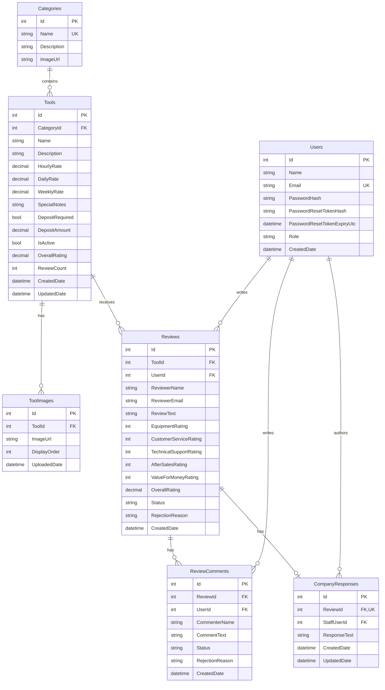

# Database Design - Tables, Relationships, and Schema

> Purpose: MSc submission database design artefact for the Shelton Tool-Hire Review Portal.
>
> Database platform: Microsoft SQL Server / Azure SQL.
>
> Implementation approach: EF Core code-first migrations using the default `dbo` schema.

---

## 1. Database Design Overview

The database supports the full review portal workflow:

- customers browse categories and tools/services
- customers calculate rental cost from hourly, daily, and weekly rates
- users register, log in, and manage their own reviews
- customers submit reviews and comments
- moderators approve or reject customer-generated content
- staff/admin users add official company responses
- admins manage categories, tools/services, images, and active/inactive status

Services such as equipment delivery or operator hire are stored in the same `Tools` table as physical equipment. They are separated in the catalogue through the `Services` category rather than a separate service table.

---

## 2. Schema Conventions

| Design Area | Convention |
|-------------|------------|
| Database schema | `dbo` |
| Primary keys | Integer identity column named `Id` |
| Foreign keys | `<ParentEntity>Id`, for example `ToolId`, `ReviewId`, `CategoryId` |
| Text columns | `nvarchar` with explicit maximum lengths where useful |
| Money/rates | `decimal(10,2)` |
| Ratings | Integer values from `1` to `5`; database check constraints enforce the range |
| Status fields | Enum values stored as strings: `Pending`, `Approved`, `Rejected` |
| Soft delete | Tools/services use `IsActive`; records are not hard-deleted from public history |
| Timestamps | `CreatedDate`, `UpdatedDate`, or `UploadedDate` use UTC dates |
| Authentication | Users are stored in the custom `Users` table with ASP.NET Core password-hasher-compatible password hashes |

---

## 3. Table Catalogue

| Table | Purpose |
|-------|---------|
| `Users` | Stores customers, admins, and moderators |
| `Categories` | Stores top-level catalogue categories |
| `Tools` | Stores physical tools and service items available for hire |
| `ToolImages` | Stores image paths/URLs for each tool/service |
| `Reviews` | Stores customer reviews and five rating categories |
| `ReviewComments` | Stores one-level comments on approved reviews |
| `CompanyResponses` | Stores official Shelton Tool-Hire staff responses |

---

## 4. Table Schemas

### 4.1 `Users`

| Column | SQL Type | Null? | Key/Constraint | Description |
|--------|----------|-------|----------------|-------------|
| `Id` | `int IDENTITY` | No | PK | Unique user identifier |
| `Name` | `nvarchar(100)` | No | Required | User display name |
| `Email` | `nvarchar(256)` | No | Unique index | Login email address |
| `PasswordHash` | `nvarchar(max)` | No | Required | Hashed password |
| `PasswordResetTokenHash` | `nvarchar(256)` | Yes | Optional | Hashed reset token for password reset flow |
| `PasswordResetTokenExpiryUtc` | `datetime2` | Yes | Optional | Reset token expiry time |
| `Role` | `nvarchar(50)` | No | Required | `Customer`, `Admin`, or `Moderator` |
| `CreatedDate` | `datetime2` | No | Default `GETUTCDATE()` | Account creation timestamp |

### 4.2 `Categories`

| Column | SQL Type | Null? | Key/Constraint | Description |
|--------|----------|-------|----------------|-------------|
| `Id` | `int IDENTITY` | No | PK | Unique category identifier |
| `Name` | `nvarchar(100)` | No | Unique index | Category name |
| `Description` | `nvarchar(500)` | Yes | Optional | Category description |
| `ImageUrl` | `nvarchar(500)` | Yes | Optional | Category image path/URL |

### 4.3 `Tools`

| Column | SQL Type | Null? | Key/Constraint | Description |
|--------|----------|-------|----------------|-------------|
| `Id` | `int IDENTITY` | No | PK | Unique tool/service identifier |
| `CategoryId` | `int` | No | FK to `Categories.Id`, indexed | Parent category |
| `Name` | `nvarchar(200)` | No | Required | Tool/service name |
| `Description` | `nvarchar(2000)` | No | Required | Full description |
| `HourlyRate` | `decimal(10,2)` | No | Required | Hire rate per hour |
| `DailyRate` | `decimal(10,2)` | No | Required | Hire rate per day |
| `WeeklyRate` | `decimal(10,2)` | No | Required | Hire rate per week |
| `SpecialNotes` | `nvarchar(1000)` | Yes | Optional | Safety notes, deposit notes, service requirements |
| `DepositRequired` | `bit` | No | Required | Whether a deposit is required |
| `DepositAmount` | `decimal(10,2)` | Yes | Optional | Deposit value when applicable |
| `IsActive` | `bit` | No | Default `1`, indexed | Public catalogue visibility flag |
| `OverallRating` | `decimal(3,2)` | Yes | Cached aggregate | Average rating from approved reviews |
| `ReviewCount` | `int` | No | Default `0` | Number of approved reviews |
| `CreatedDate` | `datetime2` | No | Default `GETUTCDATE()` | Record creation timestamp |
| `UpdatedDate` | `datetime2` | No | Default `GETUTCDATE()` | Last update timestamp |

### 4.4 `ToolImages`

| Column | SQL Type | Null? | Key/Constraint | Description |
|--------|----------|-------|----------------|-------------|
| `Id` | `int IDENTITY` | No | PK | Unique image identifier |
| `ToolId` | `int` | No | FK to `Tools.Id` | Parent tool/service |
| `ImageUrl` | `nvarchar(500)` | No | Required | Stored image URL/path |
| `DisplayOrder` | `int` | No | Default `0` | Ordering for gallery display |
| `UploadedDate` | `datetime2` | No | Default `GETUTCDATE()` | Upload timestamp |

### 4.5 `Reviews`

| Column | SQL Type | Null? | Key/Constraint | Description |
|--------|----------|-------|----------------|-------------|
| `Id` | `int IDENTITY` | No | PK | Unique review identifier |
| `ToolId` | `int` | No | FK to `Tools.Id`, indexed | Reviewed tool/service |
| `UserId` | `int` | Yes | FK to `Users.Id`, indexed | Logged-in user, nullable for anonymous reviews |
| `ReviewerName` | `nvarchar(100)` | No | Required | Public reviewer name |
| `ReviewerEmail` | `nvarchar(256)` | No | Required | Reviewer email for contact/account matching |
| `ReviewText` | `nvarchar(2000)` | No | Required | Written review text |
| `EquipmentRating` | `int` | No | Check `1` to `5` | Equipment performance rating |
| `CustomerServiceRating` | `int` | No | Check `1` to `5` | Booking/customer service rating |
| `TechnicalSupportRating` | `int` | No | Check `1` to `5` | Technical support rating |
| `AfterSalesRating` | `int` | No | Check `1` to `5` | After-sales/breakdown support rating |
| `ValueForMoneyRating` | `int` | No | Check `1` to `5` | Value for money rating |
| `OverallRating` | `decimal(3,2)` | No | Computed by domain/service logic | Average of the five ratings |
| `Status` | `nvarchar(20)` | No | Indexed | `Pending`, `Approved`, or `Rejected` |
| `RejectionReason` | `nvarchar(500)` | Yes | Optional | Moderator reason when rejected |
| `CreatedDate` | `datetime2` | No | Default `GETUTCDATE()` | Submission timestamp |

### 4.6 `ReviewComments`

| Column | SQL Type | Null? | Key/Constraint | Description |
|--------|----------|-------|----------------|-------------|
| `Id` | `int IDENTITY` | No | PK | Unique comment identifier |
| `ReviewId` | `int` | No | FK to `Reviews.Id` | Parent review |
| `UserId` | `int` | Yes | FK to `Users.Id` | Logged-in commenter, nullable for anonymous comments |
| `CommenterName` | `nvarchar(100)` | No | Required | Display name for comment |
| `CommentText` | `nvarchar(1000)` | No | Required | Comment content |
| `Status` | `nvarchar(20)` | No | Indexed | `Pending`, `Approved`, or `Rejected` |
| `RejectionReason` | `nvarchar(500)` | Yes | Optional | Moderator reason when rejected |
| `CreatedDate` | `datetime2` | No | Default `GETUTCDATE()` | Submission timestamp |

### 4.7 `CompanyResponses`

| Column | SQL Type | Null? | Key/Constraint | Description |
|--------|----------|-------|----------------|-------------|
| `Id` | `int IDENTITY` | No | PK | Unique response identifier |
| `ReviewId` | `int` | No | FK to `Reviews.Id`, unique index | Parent approved review; one response per review |
| `StaffUserId` | `int` | No | FK to `Users.Id` | Staff/admin author |
| `ResponseText` | `nvarchar(2000)` | No | Required | Official company response text |
| `CreatedDate` | `datetime2` | No | Default `GETUTCDATE()` | Response creation timestamp |
| `UpdatedDate` | `datetime2` | No | Default `GETUTCDATE()` | Last edit timestamp |

---

## 5. Relationship Design

| Relationship | Cardinality | Foreign Key | Delete Behaviour | Reason |
|--------------|-------------|-------------|------------------|--------|
| `Categories` to `Tools` | One-to-many | `Tools.CategoryId` | Restrict | Prevent deleting a category that still owns tools/services |
| `Tools` to `ToolImages` | One-to-many | `ToolImages.ToolId` | Cascade | Tool images belong to the tool/service |
| `Tools` to `Reviews` | One-to-many | `Reviews.ToolId` | Restrict | Preserve review history and avoid accidental data loss |
| `Users` to `Reviews` | One-to-many | `Reviews.UserId` | Set null | Preserve anonymous/historical reviews if a user is removed |
| `Reviews` to `ReviewComments` | One-to-many | `ReviewComments.ReviewId` | Cascade | Comments belong to their parent review |
| `Users` to `ReviewComments` | One-to-many | `ReviewComments.UserId` | Set null | Preserve comments if a user account is removed |
| `Reviews` to `CompanyResponses` | One-to-one | `CompanyResponses.ReviewId` | Cascade | Official response belongs to its parent review |
| `Users` to `CompanyResponses` | One-to-many | `CompanyResponses.StaffUserId` | Restrict | Preserve auditability of staff responses |

---

## 6. Indexes and Constraints

### 6.1 Indexes

| Table | Index | Purpose |
|-------|-------|---------|
| `Users` | Unique index on `Email` | Prevent duplicate accounts and speed up login lookup |
| `Categories` | Unique index on `Name` | Prevent duplicate category names |
| `Tools` | Index on `CategoryId` | Fast category browsing |
| `Tools` | Index on `IsActive` | Fast public/admin active-status filtering |
| `Reviews` | Index on `ToolId` | Fast review lookup for a tool/service |
| `Reviews` | Index on `Status` | Fast moderation queue and approved-review queries |
| `Reviews` | Index on `UserId` | Fast "My Reviews" page |
| `ReviewComments` | Index on `ReviewId` | Fast comment lookup for a review |
| `ReviewComments` | Index on `Status` | Fast pending-comment moderation queue |
| `CompanyResponses` | Unique index on `ReviewId` | Enforce one company response per review |

### 6.2 Check Constraints

| Constraint | Table | Rule |
|------------|-------|------|
| `CK_Reviews_EquipmentRating_Range` | `Reviews` | `EquipmentRating BETWEEN 1 AND 5` |
| `CK_Reviews_CustomerServiceRating_Range` | `Reviews` | `CustomerServiceRating BETWEEN 1 AND 5` |
| `CK_Reviews_TechnicalSupportRating_Range` | `Reviews` | `TechnicalSupportRating BETWEEN 1 AND 5` |
| `CK_Reviews_AfterSalesRating_Range` | `Reviews` | `AfterSalesRating BETWEEN 1 AND 5` |
| `CK_Reviews_ValueForMoneyRating_Range` | `Reviews` | `ValueForMoneyRating BETWEEN 1 AND 5` |

### 6.3 Business Rules Enforced Above the Database

Some rules need service-layer validation because they depend on current workflow state rather than simple column values:

| Rule | Enforcement Location |
|------|----------------------|
| Review text minimum 20 characters | API/service validation |
| Comment text minimum 10 characters | API/service validation |
| Reviews/comments start as `Pending` | Review service |
| Only approved reviews are public | Review query filters |
| Only approved reviews can receive company responses | Review service |
| Tool/service must keep at least one image | Image service/admin flow |
| End rental date/time must be later than start date/time | Rental calculator service |
| Public catalogue hides inactive tools/services | Tool query filters |

---

## 7. ER Diagram



---

## 8. Schema Creation and Migration Process

The schema is created and updated through EF Core migrations.

```powershell
dotnet ef migrations add <MigrationName> --project src/ReviewPortal.Infrastructure --startup-project src/ReviewPortal.API
dotnet ef migrations script <FromMigration> <ToMigration> --idempotent --output scripts/sql/<MigrationName>.sql --project src/ReviewPortal.Infrastructure --startup-project src/ReviewPortal.API
dotnet ef database update --project src/ReviewPortal.Infrastructure --startup-project src/ReviewPortal.API
```

For deployment, generated SQL scripts are stored in `scripts/sql/` and can be applied to Azure SQL after local verification.

---

## 9. Normalisation and Design Justification

| Decision | Justification |
|----------|---------------|
| Separate `ToolImages` table | Allows multiple images per tool/service and individual image management |
| Separate `Reviews`, `ReviewComments`, and `CompanyResponses` tables | Keeps review content, community discussion, and official company content distinct |
| `OverallRating` and `ReviewCount` cached on `Tools` | Speeds up catalogue pages without recalculating aggregates on every request |
| Services stored in `Tools` | Avoids duplicate schema because services share the same fields as hire equipment |
| `Status` on reviews/comments | Supports moderation without physically deleting or hiding records manually |
| `IsActive` on tools/services | Supports soft-delete and preserves historical review relationships |
| Unique company response per review | Enforces the requirement that there can be only one official response |
