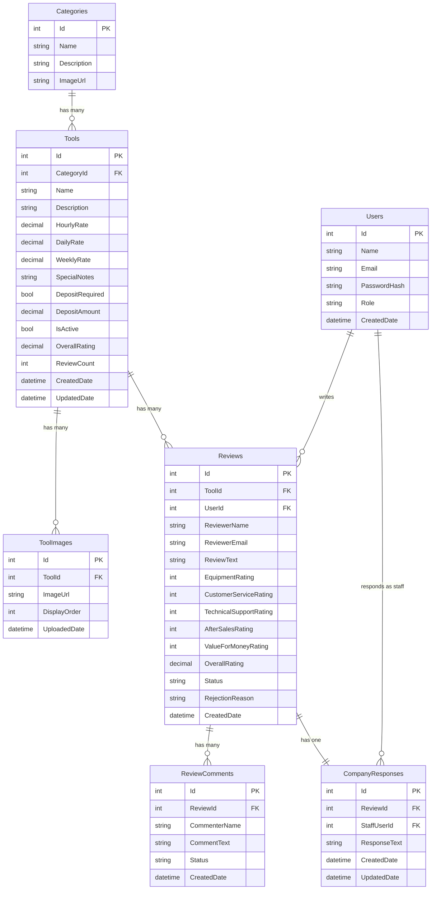

# Entity Relationship Diagram – Shelton Tool-Hire Review Portal

This document describes the complete data model for the Review Portal, covering all entities derived from the project's user stories (US-1.9, US-2.9, and Epic 3 requirements).

---

## ER Diagram

---

## Entity Details

### 1. Users

Stores all registered users — both customers and staff/admin accounts. Authentication uses ASP.NET Identity with JWT tokens.

| Field | Type | Constraints | Description |
|-------|------|-------------|-------------|
| **Id** | `int` | PK, Identity | Unique user identifier |
| **Name** | `nvarchar(100)` | Required | Display name |
| **Email** | `nvarchar(256)` | Required, Unique | Login email address |
| **PasswordHash** | `nvarchar(max)` | Required | Hashed password (ASP.NET Identity) |
| **Role** | `nvarchar(50)` | Required, Default: `"Customer"` | `Customer`, `Admin`, or `Moderator` |
| **CreatedDate** | `datetime2` | Required, Default: `GETUTCDATE()` | Account creation timestamp |

---

### 2. Categories

Top-level groupings for the tool catalogue (e.g. Building & Construction, Garden & Landscaping).

| Field | Type | Constraints | Description |
|-------|------|-------------|-------------|
| **Id** | `int` | PK, Identity | Unique category identifier |
| **Name** | `nvarchar(100)` | Required, Unique | Category display name |
| **Description** | `nvarchar(500)` | Optional | Short description of the category |
| **ImageUrl** | `nvarchar(500)` | Optional | URL to the category image |

---

### 3. Tools

Individual pieces of hire equipment. Each tool belongs to one category and has three-tier pricing.

| Field | Type | Constraints | Description |
|-------|------|-------------|-------------|
| **Id** | `int` | PK, Identity | Unique tool identifier |
| **CategoryId** | `int` | FK → Categories.Id, Required | Parent category |
| **Name** | `nvarchar(200)` | Required | Tool display name |
| **Description** | `nvarchar(2000)` | Required | Full description of the tool |
| **HourlyRate** | `decimal(10,2)` | Required | Hire rate per hour (£) |
| **DailyRate** | `decimal(10,2)` | Required | Hire rate per day (£) |
| **WeeklyRate** | `decimal(10,2)` | Required | Hire rate per week (£) |
| **SpecialNotes** | `nvarchar(1000)` | Optional | E.g. "requires a deposit", "needs a trained operator" |
| **DepositRequired** | `bit` | Required, Default: `0` | Whether a deposit is required |
| **DepositAmount** | `decimal(10,2)` | Optional | Deposit amount if required (£) |
| **IsActive** | `bit` | Required, Default: `1` | Soft-delete flag; `0` = deactivated |
| **OverallRating** | `decimal(3,2)` | Optional | Cached average of all review ratings |
| **ReviewCount** | `int` | Required, Default: `0` | Cached total number of approved reviews |
| **CreatedDate** | `datetime2` | Required, Default: `GETUTCDATE()` | Record creation timestamp |
| **UpdatedDate** | `datetime2` | Required, Default: `GETUTCDATE()` | Last update timestamp |

> [!NOTE]
> `OverallRating` and `ReviewCount` are denormalised fields updated when reviews are approved/rejected. This avoids expensive aggregate queries on every catalogue page load.

---

### 4. ToolImages

Stores image references for each tool. At least one image is required per tool.

| Field | Type | Constraints | Description |
|-------|------|-------------|-------------|
| **Id** | `int` | PK, Identity | Unique image identifier |
| **ToolId** | `int` | FK → Tools.Id, Required | Parent tool |
| **ImageUrl** | `nvarchar(500)` | Required | URL/path to the image file |
| **DisplayOrder** | `int` | Required, Default: `0` | Controls the image carousel order |
| **UploadedDate** | `datetime2` | Required, Default: `GETUTCDATE()` | When the image was uploaded |

---

### 5. Reviews

Customer reviews for tools. Each review includes written feedback and five individual star ratings.

| Field | Type | Constraints | Description |
|-------|------|-------------|-------------|
| **Id** | `int` | PK, Identity | Unique review identifier |
| **ToolId** | `int` | FK → Tools.Id, Required, Indexed | The tool being reviewed |
| **UserId** | `int` | FK → Users.Id, Nullable | Logged-in reviewer (null for anonymous) |
| **ReviewerName** | `nvarchar(100)` | Required | Reviewer's display name |
| **ReviewerEmail** | `nvarchar(256)` | Required | Reviewer's email (for anonymous submissions) |
| **ReviewText** | `nvarchar(2000)` | Required, Min: 20 chars | Written review content |
| **EquipmentRating** | `int` | Required, Range: 1–5 | Equipment Performance rating |
| **CustomerServiceRating** | `int` | Required, Range: 1–5 | Booking & Customer Service rating |
| **TechnicalSupportRating** | `int` | Required, Range: 1–5 | Technical Support & Guidance rating |
| **AfterSalesRating** | `int` | Required, Range: 1–5 | After-Sales & Breakdown Support rating |
| **ValueForMoneyRating** | `int` | Required, Range: 1–5 | Value for Money rating |
| **OverallRating** | `decimal(3,2)` | Computed | Average of the five ratings |
| **Status** | `nvarchar(20)` | Required, Indexed, Default: `"Pending"` | `Pending`, `Approved`, or `Rejected` |
| **RejectionReason** | `nvarchar(500)` | Optional | Moderator's reason if rejected |
| **CreatedDate** | `datetime2` | Required, Default: `GETUTCDATE()` | Submission timestamp |

> [!IMPORTANT]
> Indexes on `ToolId` and `Status` are essential for query performance — the catalogue page queries approved reviews per tool, and the moderation queue queries all pending items.

---

### 6. ReviewComments

Customer comments on existing reviews. One level deep only (no nested threading).

| Field | Type | Constraints | Description |
|-------|------|-------------|-------------|
| **Id** | `int` | PK, Identity | Unique comment identifier |
| **ReviewId** | `int` | FK → Reviews.Id, Required | Parent review |
| **CommenterName** | `nvarchar(100)` | Required | Commenter's display name |
| **CommentText** | `nvarchar(1000)` | Required, Min: 10 chars | Comment content |
| **Status** | `nvarchar(20)` | Required, Default: `"Pending"` | `Pending`, `Approved`, or `Rejected` |
| **CreatedDate** | `datetime2` | Required, Default: `GETUTCDATE()` | Submission timestamp |

---

### 7. CompanyResponses

Official Shelton Tool-Hire responses to customer reviews. One response per review, posted by staff.

| Field | Type | Constraints | Description |
|-------|------|-------------|-------------|
| **Id** | `int` | PK, Identity | Unique response identifier |
| **ReviewId** | `int` | FK → Reviews.Id, Required, Unique | Parent review (one-to-one) |
| **StaffUserId** | `int` | FK → Users.Id, Required | Staff member who wrote the response |
| **ResponseText** | `nvarchar(2000)` | Required | Official response text |
| **CreatedDate** | `datetime2` | Required, Default: `GETUTCDATE()` | When the response was posted |
| **UpdatedDate** | `datetime2` | Required, Default: `GETUTCDATE()` | Last edit timestamp |

> [!NOTE]
> Company responses bypass moderation — they go live immediately as they are posted by authorised staff.

---

## Relationships Summary

| Relationship | Cardinality | Description |
|-------------|-------------|-------------|
| Categories → Tools | One-to-Many | A category contains many tools; each tool belongs to one category |
| Tools → ToolImages | One-to-Many | A tool has one or more images; each image belongs to one tool |
| Tools → Reviews | One-to-Many | A tool can have many reviews; each review is for one tool |
| Users → Reviews | One-to-Many | A user can write many reviews; each review has at most one user |
| Reviews → ReviewComments | One-to-Many | A review can have many comments; each comment belongs to one review |
| Reviews → CompanyResponses | One-to-One | A review has at most one official company response |
| Users → CompanyResponses | One-to-Many | A staff user can author many company responses |

---

## Indexes

| Table | Column(s) | Rationale |
|-------|-----------|-----------|
| Tools | `CategoryId` | Category page queries |
| Tools | `IsActive` | Filter active/inactive in catalogue vs admin |
| Reviews | `ToolId` | Fetch reviews for a specific tool |
| Reviews | `Status` | Moderation queue and approved-only queries |
| Reviews | `UserId` | "My Reviews" page queries |
| CompanyResponses | `ReviewId` | Unique constraint — one response per review |
