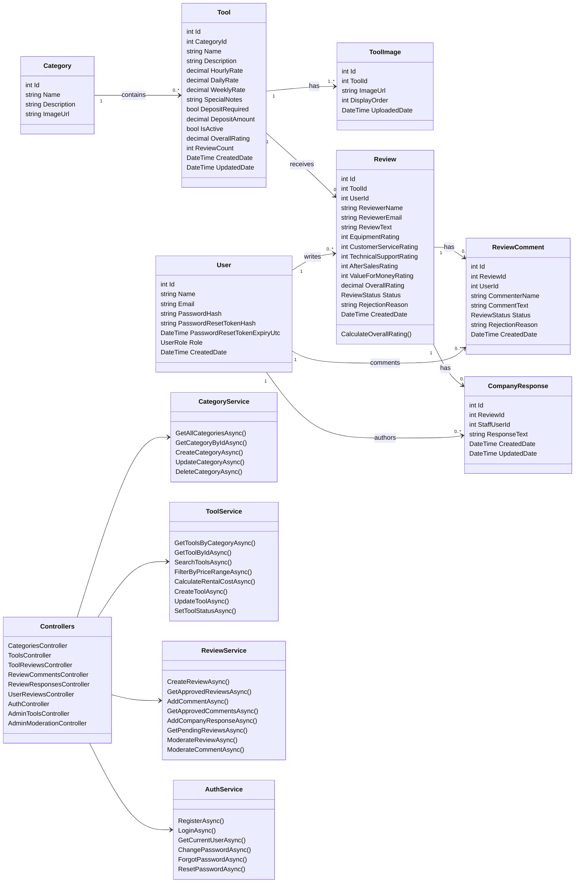
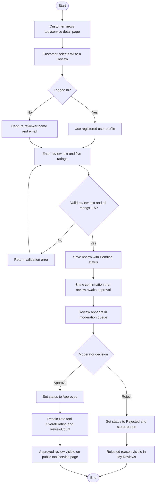
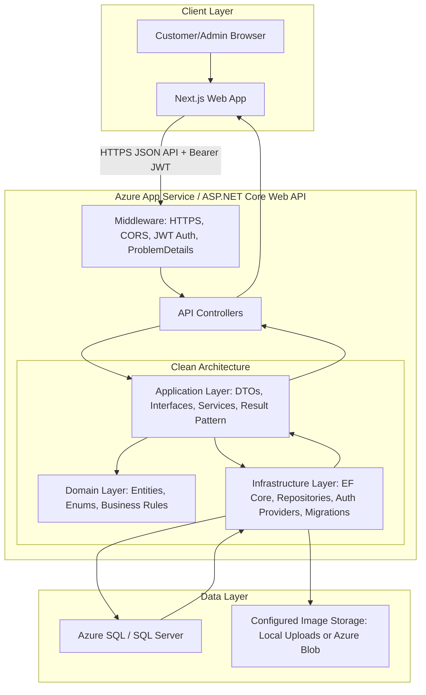
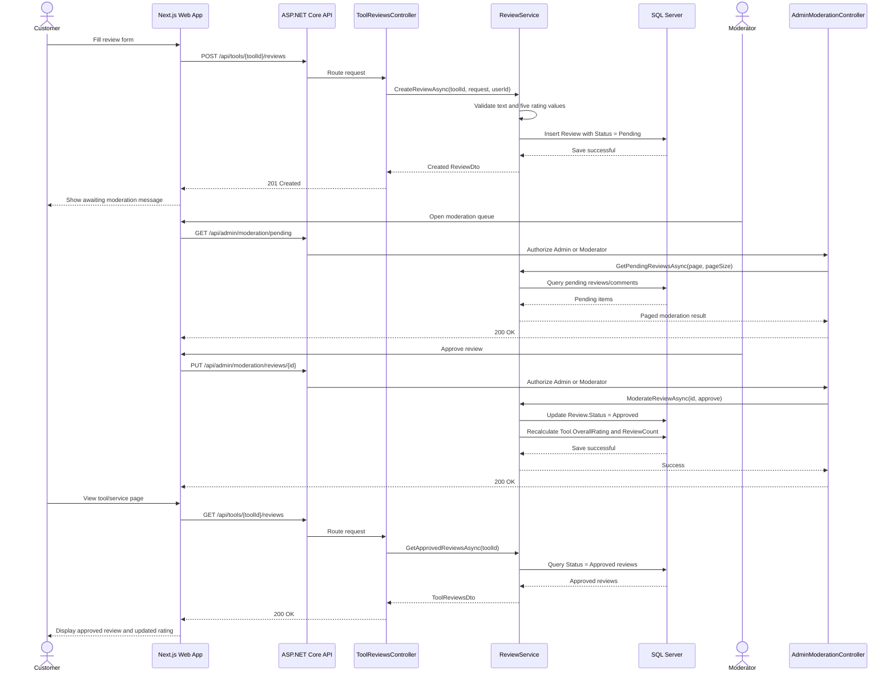
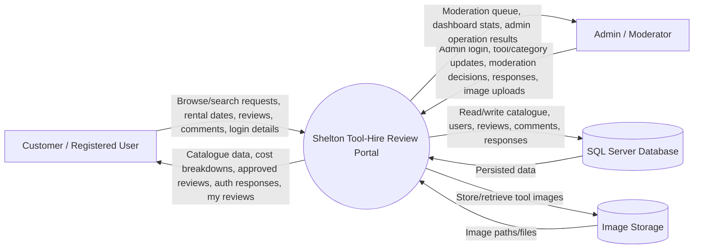
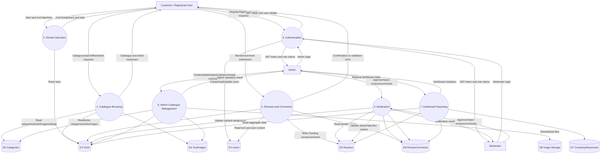
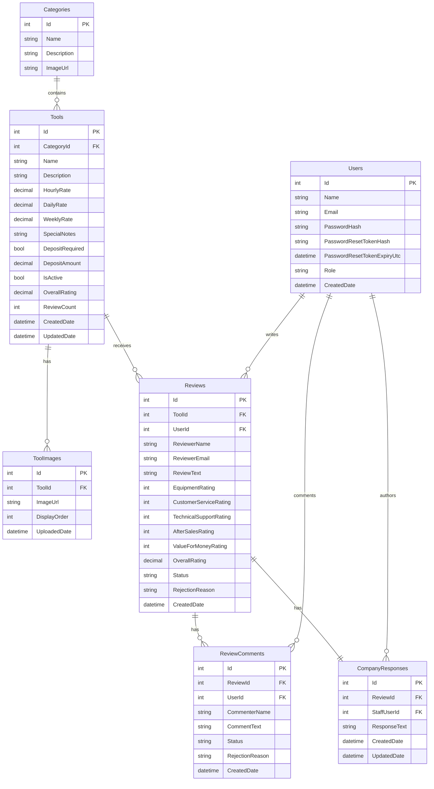

# Functional Design Diagrams - Shelton Tool-Hire Review Portal

> Purpose: MSc submission design artefact covering UML, DFD, ERD, and high-level architecture for the Shelton Tool-Hire Review Portal.
>
> Scope: Full web system design, including the Next.js client, ASP.NET Core Web API, SQL Server database, catalogue, rental calculator, reviews, moderation, and back-office administration.

---

## 1. Use Case Diagram

This diagram shows the main functional use cases for customers, registered users, admins, and moderators.

```mermaid
flowchart LR
    Customer["Customer / Visitor"]
    RegisteredUser["Registered User"]
    Admin["Admin"]
    Moderator["Moderator"]

    subgraph PublicPortal["Public Portal"]
        UC1(("Browse categories"))
        UC2(("View tool/service details"))
        UC3(("Search tools/services"))
        UC4(("Filter and sort catalogue"))
        UC5(("Calculate rental cost"))
        UC6(("Read approved reviews"))
        UC7(("Register account"))
        UC8(("Log in"))
        UC9(("Submit review"))
        UC10(("Comment on approved review"))
        UC11(("View my reviews"))
    end

    subgraph BackOffice["Back-Office Portal"]
        UC12(("Manage tools/services"))
        UC13(("Create tool/service"))
        UC14(("Edit pricing and details"))
        UC15(("Activate/deactivate tool/service"))
        UC16(("Manage images"))
        UC17(("Manage categories"))
        UC18(("View moderation queue"))
        UC19(("Approve/reject reviews"))
        UC20(("Approve/reject comments"))
        UC21(("Post company response"))
        UC22(("View dashboard stats"))
    end

    Customer --> UC1
    Customer --> UC2
    Customer --> UC3
    Customer --> UC4
    Customer --> UC5
    Customer --> UC6
    Customer --> UC7
    Customer --> UC8
    Customer --> UC9
    Customer --> UC10

    RegisteredUser --> UC8
    RegisteredUser --> UC9
    RegisteredUser --> UC10
    RegisteredUser --> UC11

    Admin --> UC8
    Admin --> UC12
    Admin --> UC13
    Admin --> UC14
    Admin --> UC15
    Admin --> UC16
    Admin --> UC17
    Admin --> UC18
    Admin --> UC19
    Admin --> UC20
    Admin --> UC21
    Admin --> UC22

    Moderator --> UC8
    Moderator --> UC18
    Moderator --> UC19
    Moderator --> UC20
```

---

## 2. Class Diagram

This UML class diagram summarises the core backend domain model and the main service/controller boundaries.

---

## 3. Activity Diagram

This activity diagram shows the review lifecycle from customer submission through moderation and publication.

---

## 4. High-Level System Architecture Diagram

This diagram shows the deployment and Clean Architecture shape of the system.

---

## 5. Sequence Diagram

This sequence diagram covers a core end-to-end flow: customer review submission, moderation, rating recalculation, and public display.

---

## 6. Data Flow Diagrams

### 6.1 Context-Level DFD

This DFD shows the system boundary and the external actors that exchange data with the Review Portal.

### 6.2 Level 1 DFD

This DFD decomposes the main backend processes and data stores.

---

## 7. Entity Relationship Diagram

The ERD below summarises the database entities, keys, and relationships. The full field-level explanation is maintained in [ERD.md](ERD.md).

---

## 8. Design Traceability Summary

| Diagram | Supports |
|---------|----------|
| Use Case Diagram | Functional scope for Epic 1, Epic 2, and Epic 3 |
| Class Diagram | Domain model, services, and controller boundaries |
| Activity Diagram | Review submission, moderation, and publication workflow |
| High-Level Architecture Diagram | Clean Architecture, API hosting, database, image storage, and frontend integration |
| Sequence Diagram | End-to-end review lifecycle across frontend, API, service, and database |
| DFD Context and Level 1 | External actors, system boundary, processes, data stores, and data movement |
| ERD | Relational schema supporting catalogue, users, reviews, comments, company responses, and images |
| Database Design | Detailed table schemas, relationships, keys, indexes, constraints, and migration process in [DATABASE-DESIGN.md](DATABASE-DESIGN.md) |
