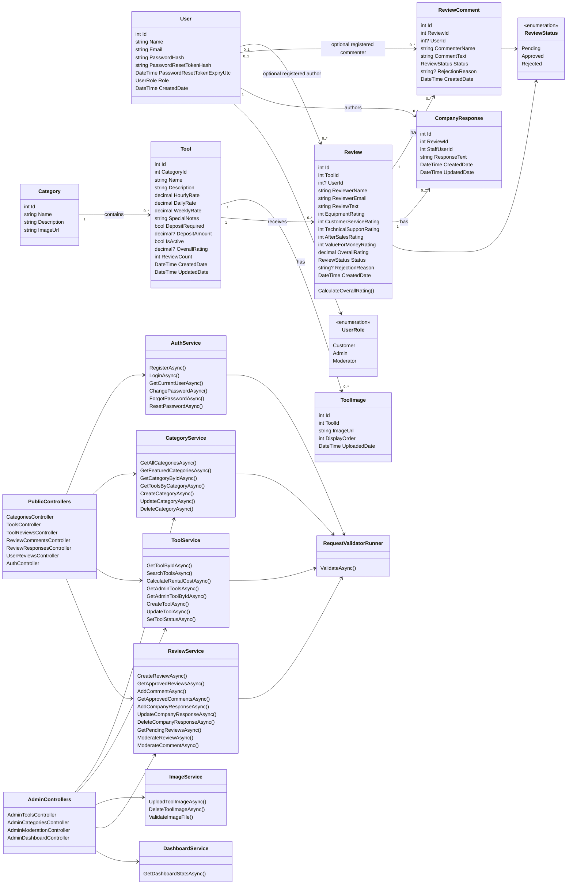
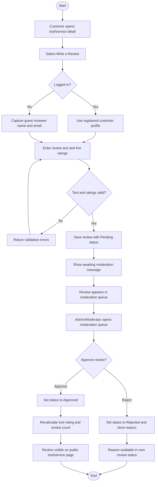
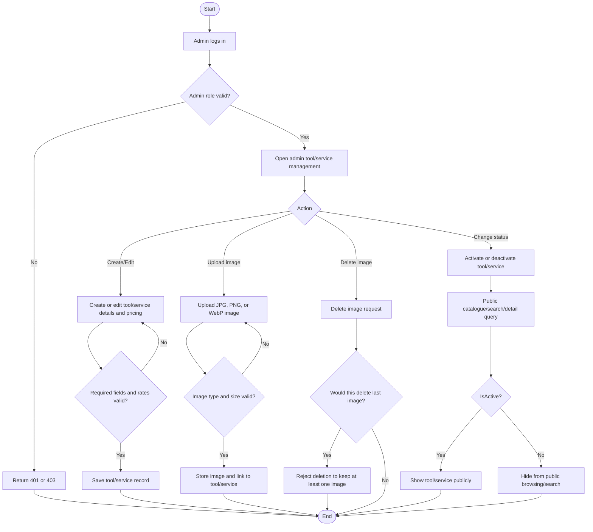
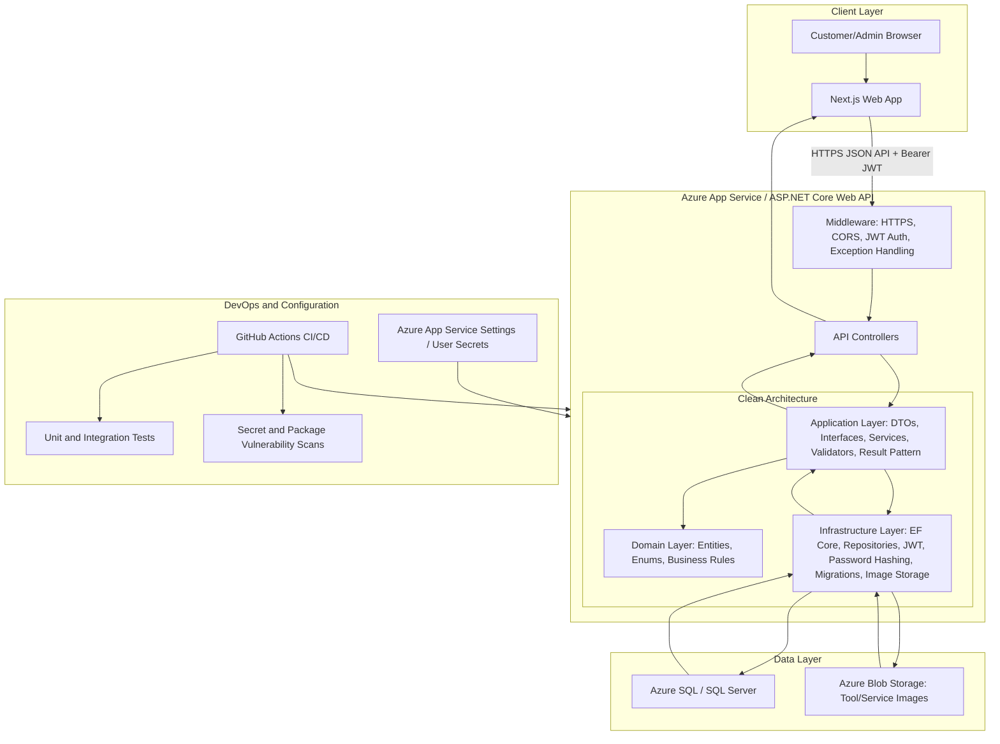
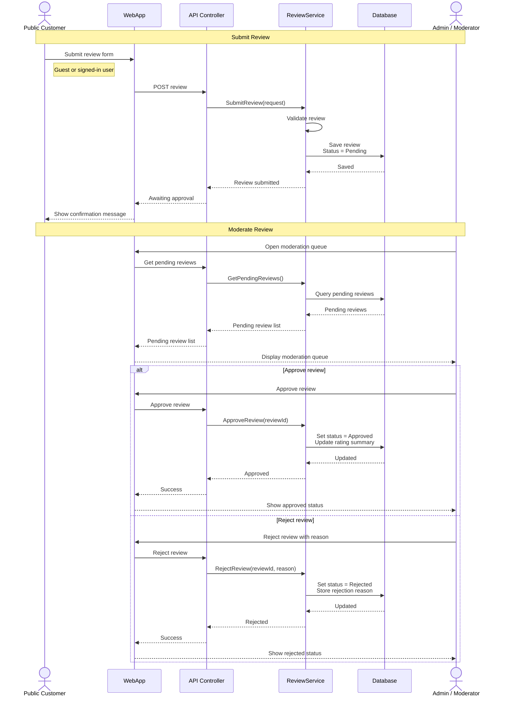
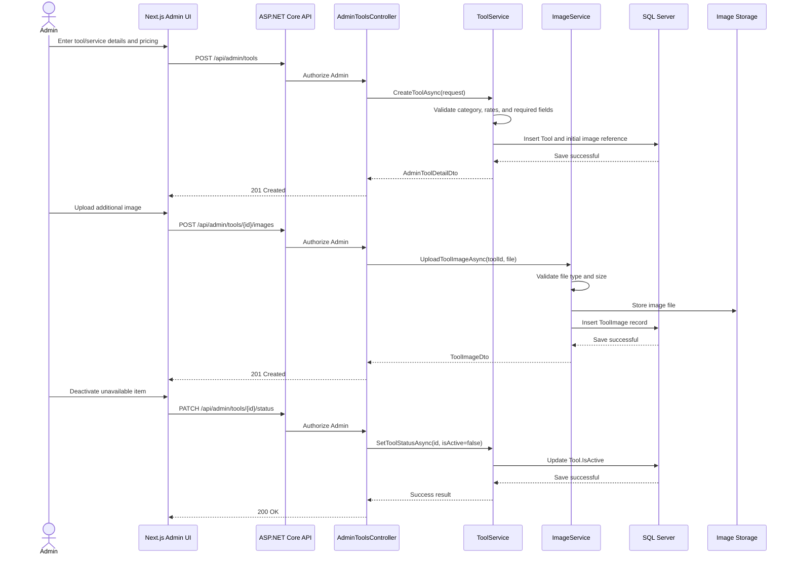
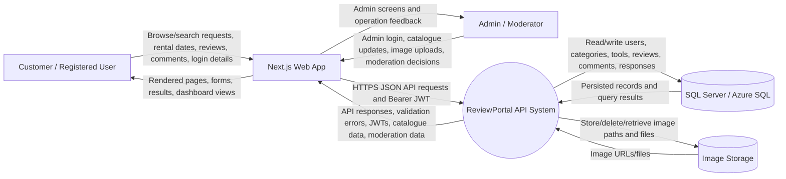
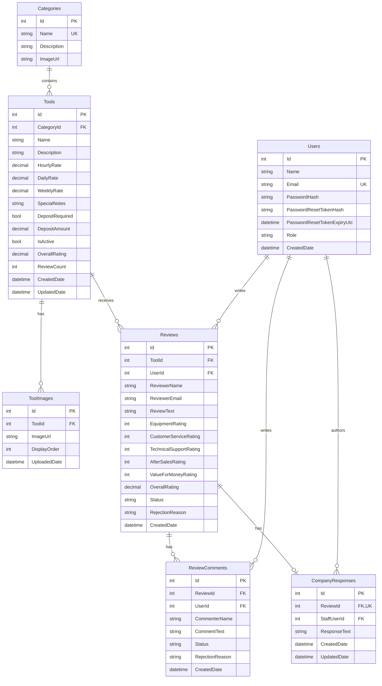

# Functional Design Diagrams - Shelton Tool-Hire Review Portal

> Purpose: MSc submission design artefact covering UML, DFD, ERD, sequence, activity, and high-level architecture diagrams.
>
> Scope: full web system design, including the Next.js client, ASP.NET Core Web API, SQL Server/Azure SQL database, catalogue, rental calculator, reviews, moderation, image management, dashboard, and back-office administration.
>
> Diagram source format: Mermaid. Older PlantUML/plain-text diagram drafts have been converted into Mermaid syntax so this file is the source of truth for generated Word diagram documents.

---

## 1. Use Case Diagram

This diagram shows the major public-customer, registered-customer, admin, and moderator use cases.

```mermaid
flowchart LR
    PublicCustomer["Public Customer<br/>(guest or signed-in)"]
    Guest["Guest Visitor"]
    RegisteredUser["Registered Customer"]
    Admin["Admin"]
    Moderator["Moderator"]

    Guest -. "specialises" .-> PublicCustomer
    RegisteredUser -. "specialises" .-> PublicCustomer

    subgraph PublicPortal["Public Portal"]
        UC1(("Browse categories"))
        UC2(("View tool/service details"))
        UC3(("Search tools/services"))
        UC4(("Filter and sort catalogue"))
        UC5(("Calculate rental cost"))
        UC6(("Read approved reviews"))
        UC7(("Register account"))
        UC8(("Log in / log out"))
        UC9(("Submit review"))
        UC10(("Comment on approved review"))
        UC11(("View own review status"))
        UC12(("Submit booking request"))
        UC13(("Manage account"))
    end

    subgraph BackOffice["Back-Office Portal"]
        UC14(("Staff log in"))
        UC15(("Manage booking requests"))
        UC16(("View moderation queue"))
        UC17(("Approve review"))
        UC18(("Reject review"))
        UC19(("Approve/reject comments"))
        UC20(("Post company response"))
        UC21(("Manage tools/services"))
        UC22(("Upload/delete images"))
        UC23(("Manage categories"))
        UC24(("View admin dashboard"))
    end

    PublicCustomer --> UC1
    PublicCustomer --> UC2
    PublicCustomer --> UC3
    PublicCustomer --> UC4
    PublicCustomer --> UC5
    PublicCustomer --> UC6
    PublicCustomer --> UC9
    PublicCustomer --> UC10
    PublicCustomer --> UC11
    PublicCustomer --> UC12

    Guest --> UC7
    Guest --> UC8
    RegisteredUser --> UC8
    RegisteredUser --> UC13

    Admin --> UC14
    Admin --> UC15
    Admin --> UC16
    Admin --> UC17
    Admin --> UC18
    Admin --> UC19
    Admin --> UC20
    Admin --> UC21
    Admin --> UC22
    Admin --> UC23
    Admin --> UC24

    Moderator --> UC14
    Moderator --> UC15
    Moderator --> UC16
    Moderator --> UC17
    Moderator --> UC18
    Moderator --> UC19
    Moderator --> UC20
```

---

## 2. Class Diagram

This UML class diagram summarises the current backend domain model, service layer, validation layer, and controller boundaries.

---

## 3. Activity Diagrams

### 3.1 Review Submission and Moderation Activity

This activity diagram shows the customer review lifecycle from submission through moderation, rejection, approval, rating recalculation, and public display. It explicitly supports both guest and signed-in customer submissions.

### 3.2 Admin Tool/Service and Image Management Activity

This activity diagram shows the current admin catalogue management flow, including validation, create/update, image upload/delete, and public visibility.

---

## 4. High-Level System Architecture Diagram

This diagram shows the Clean Architecture structure, deployment shape, external configuration, testing, and frontend integration points.

---

## 5. Sequence Diagrams

### 5.1 Review Lifecycle Sequence

This sequence diagram covers customer review submission, moderation, approval, rejection, and rating-summary updates.

### 5.2 Admin Tool/Service and Image Sequence

This sequence diagram covers the back-office flow for creating or updating a tool/service and managing images.

---

## 6. Data Flow Diagrams

### 6.1 Context-Level DFD

This context-level DFD shows the system boundary and external actors that exchange data with the Review Portal.

### 6.2 Level 1 DFD

This DFD decomposes the main backend processes and data stores.

```mermaid
flowchart TB
    Customer["Customer / Registered User"]
    Admin["Admin"]
    Moderator["Moderator"]

    P1(("1. Catalogue Browsing"))
    P2(("2. Rental Calculator"))
    P3(("3. Authentication"))
    P4(("4. Reviews and Comments"))
    P5(("5. Moderation"))
    P6(("6. Admin Tool and Category Management"))
    P7(("7. Image Management"))
    P8(("8. Dashboard Reporting"))

    D1[("D1 Users")]
    D2[("D2 Categories")]
    D3[("D3 Tools")]
    D4[("D4 ToolImages")]
    D5[("D5 Reviews")]
    D6[("D6 ReviewComments")]
    D7[("D7 CompanyResponses")]
    D8[("D8 Image Storage")]

    Customer -->|"Category/search/filter/detail requests"| P1
    P1 -->|"Read categories"| D2
    P1 -->|"Read active tools and ratings"| D3
    P1 -->|"Read image references"| D4
    P1 -->|"Catalogue/detail results"| Customer

    Customer -->|"Start and end date/time"| P2
    P2 -->|"Read hourly/daily/weekly rates"| D3
    P2 -->|"Cost breakdown and total"| Customer

    Customer -->|"Register/login/password reset"| P3
    Admin -->|"Admin login"| P3
    Moderator -->|"Moderator login"| P3
    P3 -->|"Create/read/update users"| D1
    P3 -->|"JWT token and role claims"| Customer
    P3 -->|"JWT token and role claims"| Admin
    P3 -->|"JWT token and role claims"| Moderator

    Customer -->|"Review/comment/company-response requests"| P4
    P4 -->|"Read user and tool context"| D1
    P4 --> D3
    P4 -->|"Write pending reviews"| D5
    P4 -->|"Write pending comments"| D6
    P4 -->|"Write official response for approved review"| D7
    P4 -->|"Confirmation or validation error"| Customer

    Moderator -->|"Approve/reject reviews/comments"| P5
    Admin -->|"Approve/reject reviews/comments"| P5
    P5 -->|"Read pending reviews/comments"| D5
    P5 --> D6
    P5 -->|"Update status and rejection reason"| D5
    P5 --> D6
    P5 -->|"Update cached rating/count"| D3
    P5 -->|"Moderation result and exact counts"| Moderator

    Admin -->|"Create/update/status/category commands"| P6
    P6 -->|"Read/write categories"| D2
    P6 -->|"Read/write tools"| D3
    P6 -->|"Admin operation result"| Admin

    Admin -->|"Upload/delete image commands"| P7
    P7 -->|"Read/write tool images"| D4
    P7 -->|"Store/delete files"| D8
    P7 -->|"Image operation result"| Admin

    Admin -->|"Request dashboard stats"| P8
    P8 -->|"Read aggregates"| D3
    P8 --> D5
    P8 --> D6
    P8 --> D7
    P8 -->|"Dashboard statistics"| Admin
```

---

## 7. Entity Relationship Diagram

The ERD summarises the database entities, keys, and relationships. The full field-level explanation is maintained in [ERD.md](ERD.md) and [DATABASE-DESIGN.md](DATABASE-DESIGN.md).

---

## 8. Design Traceability Summary

| Diagram | Supports |
|---------|----------|
| Use Case Diagram | Functional scope for Epic 1, Epic 2, and Epic 3 |
| Class Diagram | Domain model, services, validators, controllers, and role/status enums |
| Activity Diagrams | Review moderation workflow and admin tool/image management workflow |
| High-Level Architecture Diagram | Clean Architecture, Azure hosting, configuration, CI/CD, tests, database, image storage, and frontend integration |
| Sequence Diagrams | End-to-end review lifecycle and admin tool/image management |
| DFD Context and Level 1 | External actors, system boundary, API processes, data stores, and data movement |
| ERD | Relational schema supporting users, categories, tools/services, images, reviews, comments, company responses, and rating aggregation |
| Database Design | Detailed table schemas, relationships, keys, indexes, constraints, and migration process in [DATABASE-DESIGN.md](DATABASE-DESIGN.md) |
