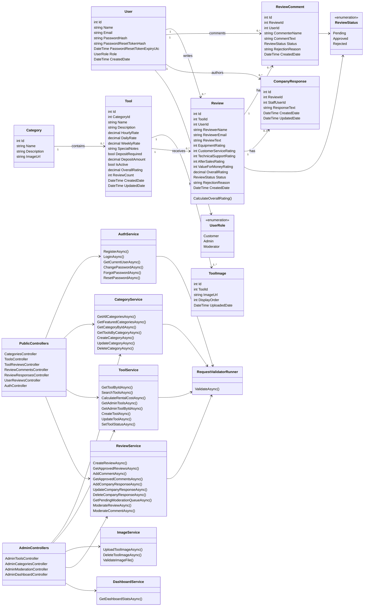
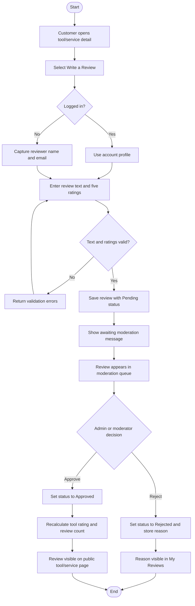
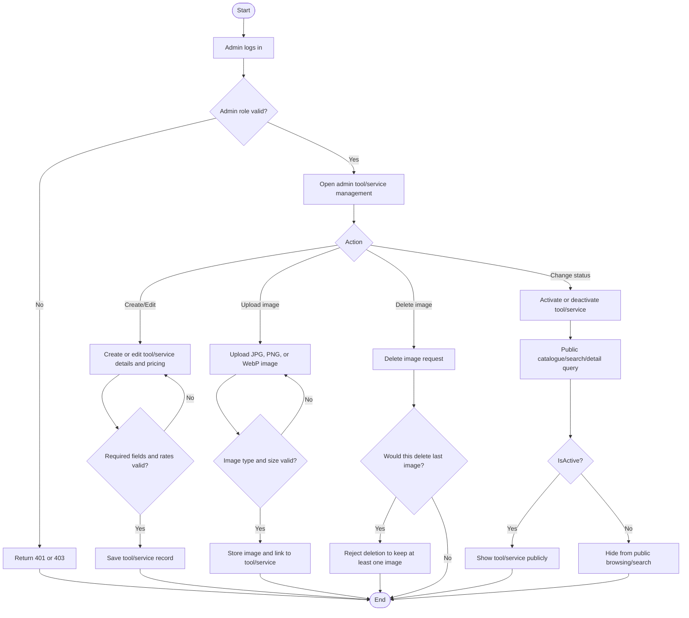
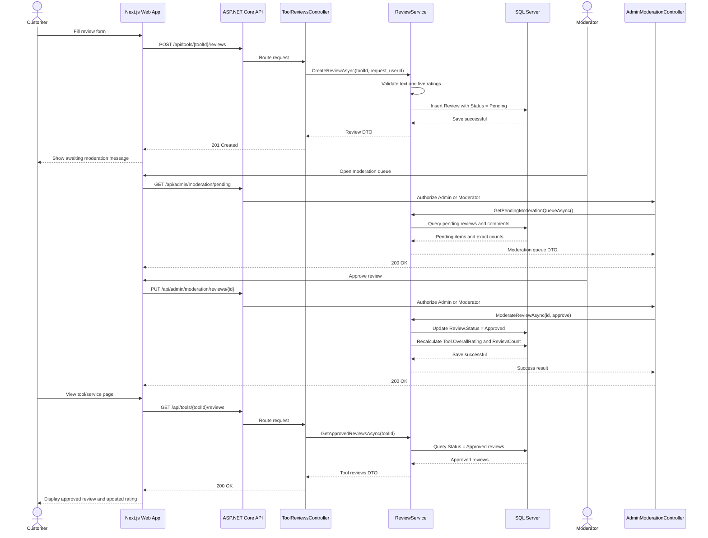
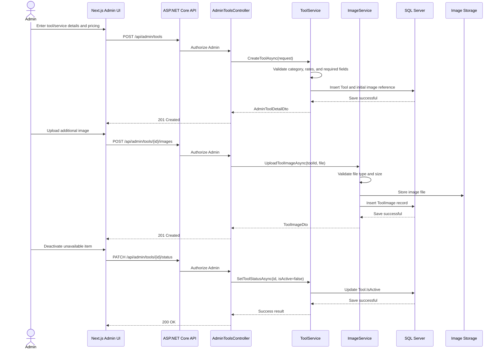
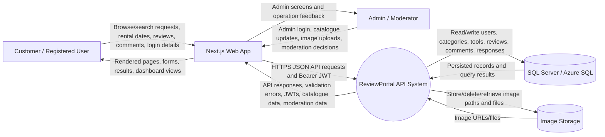
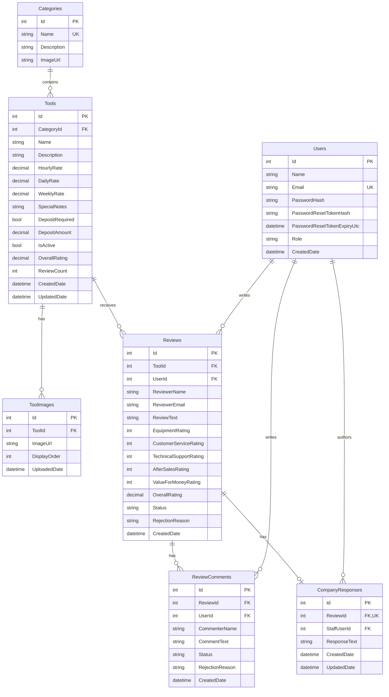

# Functional Design (UML, DFDs, ERDs, Etc)

**Module:** COMP70066 Software Engineering Principles and Practices  
**Project:** Shelton Tool-Hire Review Portal System  
**Document Context:** Group Portfolio Submission – Stage 3 (Requirements & Design) and Stage 4 (Implementation & Completion)  
**Authors/Contributors:** Chamara Iresh Wijerathna (Scrum Master & Backend Developer), Sadisha Dilmin Samarasinghe (Frontend Developer), Fathima Safa Firzan (Product Owner, Requirements & Testing)

---

## 1. Executive Summary & System Boundary

This document outlines the **Functional Design** of the Shelton Tool-Hire Review Portal. It comprises standard software engineering models, including Unified Modeling Language (UML) Use Cases, Class Diagrams, Activity Flows, Sequence Interactions, Structured Data Flow Diagrams (DFDs), and the Entity Relationship Diagram (ERD).

The system boundary encompasses two primary software layers:
1. **Public Portal (Next.js Client):** A responsive customer-facing web application that allows visitors to browse the tool and service catalogue, search and filter listings, compute exact rental costs using an interactive calculator, read approved reviews, register/log in, and submit multidimensional ratings and comments.
2. **Back-Office API (ASP.NET Core Web API):** A secure administrative portal that allows authenticated staff (Administrators and Moderators) to manage the catalogue, upload images directly to Azure Blob Storage, moderate reviews and comments, and view operational dashboard statistics.

The architecture is built on **Clean Architecture** principles, maintaining strict separation of concerns between domain business logic, application request pipeline, infrastructure integration (Entity Framework Core & Cloud Storage), and the API controllers layer.

---

## 2. Use Case Modeling (UML)

The UML Use Case model establishes the functional scope of the platform by defining the boundaries between external actors and internal system operations.

### 2.1 Use Case Diagram

```mermaid
flowchart LR
    PublicCustomer["Public Customer<br/>(guest or signed-in)"]
    Guest["Guest Visitor"]
    RegisteredUser["Registered Customer"]
    Admin["Admin"]
    Moderator["Moderator"]

    Guest -. "specialises" .-> PublicCustomer
    RegisteredUser -. "specialises" .-> PublicCustomer

    subgraph PublicPortal["Public Portal"]
        UC1(("Browse categories"))
        UC2(("View tool/service details"))
        UC3(("Search tools/services"))
        UC4(("Filter and sort catalogue"))
        UC5(("Calculate rental cost"))
        UC6(("Read approved reviews"))
        UC7(("Register account"))
        UC8(("Log in / log out"))
        UC9(("Submit review"))
        UC10(("Comment on approved review"))
        UC11(("View own review status"))
        UC12(("Submit booking request"))
        UC13(("Manage account"))
    end

    subgraph BackOffice["Back-Office Portal"]
        UC14(("Staff log in"))
        UC15(("Manage booking requests"))
        UC16(("View moderation queue"))
        UC17(("Approve review"))
        UC18(("Reject review"))
        UC19(("Approve/reject comments"))
        UC20(("Post company response"))
        UC21(("Manage tools/services"))
        UC22(("Upload/delete images"))
        UC23(("Manage categories"))
        UC24(("View admin dashboard"))
    end

    PublicCustomer --> UC1
    PublicCustomer --> UC2
    PublicCustomer --> UC3
    PublicCustomer --> UC4
    PublicCustomer --> UC5
    PublicCustomer --> UC6
    PublicCustomer --> UC9
    PublicCustomer --> UC10
    PublicCustomer --> UC11
    PublicCustomer --> UC12

    Guest --> UC7
    Guest --> UC8
    RegisteredUser --> UC8
    RegisteredUser --> UC13

    Admin --> UC14
    Admin --> UC15
    Admin --> UC16
    Admin --> UC17
    Admin --> UC18
    Admin --> UC19
    Admin --> UC20
    Admin --> UC21
    Admin --> UC22
    Admin --> UC23
    Admin --> UC24

    Moderator --> UC14
    Moderator --> UC15
    Moderator --> UC16
    Moderator --> UC17
    Moderator --> UC18
    Moderator --> UC19
    Moderator --> UC20
```

### 2.2 Actor Specifications

| Actor | Type | Description |
| :--- | :--- | :--- |
| **Public Customer** | External | A public user of the portal, whether browsing as a guest or signed in as a customer. Can search products, calculate rental costs, view approved reviews, submit reviews/comments, track submitted review status, and submit booking requests. |
| **Guest Visitor** | External | An unauthenticated public customer. Can register or log in, but does not need to log in before submitting a review/comment when name and contact details are supplied. |
| **Registered Customer** | External | An authenticated customer. Has all public customer capabilities and can manage their account. |
| **Moderator** | Internal | An authenticated staff member responsible for moderation and booking-request handling. Can view the moderation queue, approve/reject reviews and comments, and post official company responses. Cannot access the admin dashboard or catalogue/category management screens. |
| **Admin** | Internal | An authenticated system administrator. Can perform moderation and booking-request handling, post official company responses, manage tools/services, images and categories, and view the admin dashboard. |

### 2.3 Use Case Directory

| ID | Name | Actor | Description |
| :--- | :--- | :--- | :--- |
| **UC1** | Browse categories | Public Customer | View all structural catalogue groupings. |
| **UC2** | View tool/service details | Public Customer | View technical details, rates, and aggregate star ratings. |
| **UC3** | Search tools/services | Public Customer | Filter catalogue items via text search on name or description. |
| **UC4** | Filter and sort catalogue | Public Customer | Refine catalogue views by categories, rating thresholds, and price. |
| **UC5** | Calculate rental cost | Public Customer | Input dates and hours to compute tiered rental prices dynamically. |
| **UC6** | Read approved reviews | Public Customer | View published customer reviews and staff responses. |
| **UC7** | Register account | Guest Visitor | Create a new user profile with secure password credentials. |
| **UC8** | Log in / log out | Guest Visitor, Registered Customer | Authenticate with email/password and end a customer session. |
| **UC9** | Submit review | Public Customer | Submit a review with 5 rating vectors and descriptive text; login is optional, not mandatory. |
| **UC10**| Comment on approved review | Public Customer | Post community commentary on an existing approved review; login is optional, not mandatory. |
| **UC11**| View own review status | Public Customer | View the moderation status of submitted reviews; guests require a reference/email lookup, while registered customers can use account identity. |
| **UC12**| Submit booking request | Public Customer | Send a hire enquiry or booking request from the public portal. |
| **UC13**| Manage account | Registered Customer | Update account details and access authenticated customer-only pages. |
| **UC14**| Staff log in | Admin, Moderator | Authenticate into the staff area using a role-bearing account. |
| **UC15**| Manage booking requests | Admin, Moderator | View and update booking request status. |
| **UC16**| View moderation queue | Admin, Moderator | Retrieve pending reviews and comments requiring action. |
| **UC17**| Approve review | Admin, Moderator | Publish a pending review and allow it to contribute to the public aggregate rating. |
| **UC18**| Reject review | Admin, Moderator | Reject a pending review and record the rejection reason. |
| **UC19**| Approve/reject comments | Admin, Moderator | Moderate public comments before publishing or rejecting them. |
| **UC20**| Post company response | Admin, Moderator | Publish an official Shelton response to an approved review. |
| **UC21**| Manage tools/services | Admin | Create, edit, activate, or deactivate catalogue entries. |
| **UC22**| Upload/delete images | Admin | Add or delete JPG/PNG/WebP media, automatically synced to Cloud Storage. |
| **UC23**| Manage categories | Admin | Create, edit, or delete catalog classifications. |
| **UC24**| View admin dashboard | Admin | Monitor platform performance metrics, review counts, and averages. |

---

## 3. Structural Domain Modeling (UML Class Diagram)

The UML Class Diagram illustrates the structural domain of the backend API, mapping the relational entities, core business services, validation orchestrations, and API controller boundaries.

### 3.1 Class Diagram

### 3.2 Domain Model Definitions & Relations

*   **Category & Tool (1:N):** A catalog Category acts as a container for multiple Tools and Services. Deleting a Category is restricted if it contains associated Tools to maintain schema integrity.
*   **Tool & ToolImage (1:N):** A Tool can possess multiple associated images (stored on Azure Blob Storage) for carousel rendering. If a tool is deleted, its image database paths are cascade deleted.
*   **Tool & Review (1:N):** A Tool receives multiple customer Reviews. To preserve aggregate history, a Tool cannot be deleted if active reviews are attached to it.
*   **User & Review (1:N):** A User writes reviews. If the user profile is deleted under GDPR rules, the User-to-Review link is set to `NULL` (SetNull action) to anonymise the review while preserving historical catalog rating aggregates.
*   **Review & ReviewComment (1:N):** A Review can receive multiple community comments. If a review is deleted, all comments belonging to it are automatically cascade deleted.
*   **Review & CompanyResponse (1:1):** An approved Review can receive at most one official staff response, which is written by an authenticated User with an Admin role.

---

## 4. Behavioral Design (UML Activity Diagrams)

Activity diagrams map the dynamic workflow logic of system processes, highlighting validations, conditional branches, and persistent state transitions.

### 4.1 Review Submission and Moderation Workflow

This diagram models the end-to-end lifecycle of customer review submission, formatting, and administrative moderation.

### 4.2 Admin Catalogue and Image Management Workflow

This diagram models the workflow for administrative catalogue management, including validation, image constraints, and soft-delete toggle behavior.

---

## 5. Interaction Design (UML Sequence Diagrams)

Sequence diagrams illustrate system object interactions sorted chronologically, demonstrating API request mapping, service boundaries, and transactional database actions.

### 5.1 Review Lifecycle Sequence

### 5.2 Admin Tool/Service and Image Sequence

---

## 6. Data Flow Diagrams (DFDs)

Data Flow Diagrams model the movement of data through the platform, illustrating external actors, internal processing blocks, and data store boundaries.

### 6.1 Context-Level DFD (Level 0)

The Level 0 DFD defines the global system boundary, outlining how external actors interact with the unified API.

### 6.2 Level 1 DFD (Decomposed Processes)

The Level 1 DFD decomposes the system boundary into 8 distinct functional processes and maps data movements between them and the 8 dedicated data stores.

```mermaid
flowchart TB
    Customer["Customer / Registered User"]
    Admin["Admin"]
    Moderator["Moderator"]

    P1(("1. Catalogue Browsing"))
    P2(("2. Rental Calculator"))
    P3(("3. Authentication"))
    P4(("4. Reviews and Comments"))
    P5(("5. Moderation"))
    P6(("6. Admin Tool and Category Management"))
    P7(("7. Image Management"))
    P8(("8. Dashboard Reporting"))

    D1[("D1 Users")]
    D2[("D2 Categories")]
    D3[("D3 Tools")]
    D4[("D4 ToolImages")]
    D5[("D5 Reviews")]
    D6[("D6 ReviewComments")]
    D7[("D7 CompanyResponses")]
    D8[("D8 Image Storage")]

    Customer -->|"Category/search/filter/detail requests"| P1
    P1 -->|"Read categories"| D2
    P1 -->|"Read active tools and ratings"| D3
    P1 -->|"Read image references"| D4
    P1 -->|"Catalogue/detail results"| Customer

    Customer -->|"Start and end date/time"| P2
    P2 -->|"Read hourly/daily/weekly rates"| D3
    P2 -->|"Cost breakdown and total"| Customer

    Customer -->|"Register/login/password reset"| P3
    Admin -->|"Admin login"| P3
    Moderator -->|"Moderator login"| P3
    P3 -->|"Create/read/update users"| D1
    P3 -->|"JWT token and role claims"| Customer
    P3 -->|"JWT token and role claims"| Admin
    P3 -->|"JWT token and role claims"| Moderator

    Customer -->|"Review/comment/company-response requests"| P4
    P4 -->|"Read user and tool context"| D1
    P4 --> D3
    P4 -->|"Write pending reviews"| D5
    P4 -->|"Write pending comments"| D6
    P4 -->|"Write official response for approved review"| D7
    P4 -->|"Confirmation or validation error"| Customer

    Moderator -->|"Approve/reject reviews/comments"| P5
    Admin -->|"Approve/reject reviews/comments"| P5
    P5 -->|"Read pending reviews/comments"| D5
    P5 --> D6
    P5 -->|"Update status and rejection reason"| D5
    P5 --> D6
    P5 -->|"Update cached rating/count"| D3
    P5 -->|"Moderation result and exact counts"| Moderator

    Admin -->|"Create/update/status/category commands"| P6
    P6 -->|"Read/write categories"| D2
    P6 -->|"Read/write tools"| D3
    P6 -->|"Admin operation result"| Admin

    Admin -->|"Upload/delete image commands"| P7
    P7 -->|"Read/write tool images"| D4
    P7 -->|"Store/delete files"| D8
    P7 -->|"Image operation result"| Admin

    Admin -->|"Request dashboard stats"| P8
    P8 -->|"Read aggregates"| D3
    P8 --> D5
    P8 --> D6
    P8 --> D7
    P8 -->|"Dashboard statistics"| Admin
```

---

## 7. Entity Relationship Diagram (ERD)

The ERD illustrates the physical relational database schema. It documents the tables, primary and foreign keys, columns, types, nullability, unique keys, and relationship cardinalities that support the system's functional operations.

---

## 8. Design Traceability Summary

The design elements are linked systematically to the software engineering goals of the Shelton Tool-Hire Review Portal.

| Diagram / Model | Targeted System Feature | Software Engineering Benefit |
| :--- | :--- | :--- |
| **UML Use Case** | Epics 1, 2, and 3 Scope | Clear functional boundaries; defines exact authorization rules (RBAC) across actors. |
| **UML Class Diagram** | Backend Domain Model & APIs | Maps entities, business services, validation orchestrations, and API controller layout, separating infrastructure from business domains. |
| **UML Activity (Reviews)**| Review Moderation Lifecycle | Highlights the conditional pathways, validation boundaries, and status changes for reviews before publication. |
| **UML Activity (Admin)** | Catalog & Image Uploads | Identifies safety checks, validation rules, soft-delete visibility, and mandatory "last-image preservation" logic. |
| **UML Sequence (Reviews)**| Transactional Moderation | Outlines message passing chronologically; demonstrates transaction isolation when rating aggregates are recalculated. |
| **UML Sequence (Admin)** | Cloud-sync Image Uploads | Demonstrates multi-step file uploads to Azure Blob Storage and saving metadata references in the database. |
| **Context DFD** | High-Level System Boundary | Highlights unified data flow channels via HTTP/JWT across external layers and Cloud/SQL infrastructures. |
| **Level 1 DFD** | Process Isolation & Data Stores | Decomposes the API into 8 central processes and maps their distinct database tables (stores) to eliminate tight coupling. |
| **ER Diagram** | Physical Database Schema | Defines constraints, keys, cascading triggers, indexes, and schemas to enforce referential integrity. |
| **Traceability Matrix** | Quality & Verification Assurance | Validates that every functional requirement maps directly to designed architectural systems, preventing feature bloat. |
