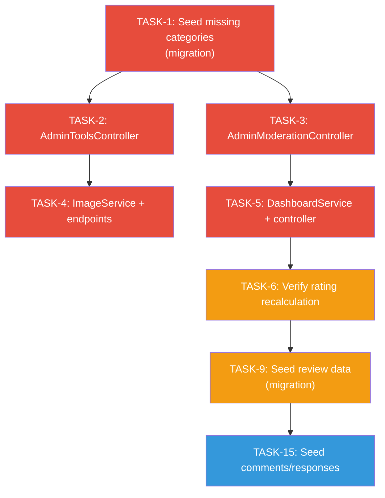

# Gap Analysis – Shelton Tool-Hire Review Portal (API Backend)

> **Last reviewed:** 27 April 2026
> **Scope:** API backend repo (`ReviewPortal-API`) only — Epic 1 and Epic 2 backend work is mostly implemented; Epic 3 is partially implemented and still has service, image, dashboard, validation, integration-test, CI, and secret-cleanup gaps.
> **Purpose:** Identify every gap between the lecture feedback, the specification documents, and what is actually built in the codebase, then list concrete tasks to close each gap.

---

## 1. Lecture Feedback Summary

| # | Feedback Point | Status |
|---|---------------|--------|
| LF-1 | No explicit treatment of **services** — add service entries, service detail pages, or searching/reviewing services separately | **Done** (Services category and service seed entries added) |
| LF-2 | User stories should say **"tool/service"** instead of just "tool" | **Done** |
| LF-3 | Sprint sequencing — "Approve or Reject Reviews" was Sprint 2 but moderation queue was Sprint 3 | **Done** (already fixed) |
| LF-4 | Sprint 1 claims approved reviews and overall rating but those features come later; needs seed data | **Done** (seed data uses pre-set `OverallRating` / `ReviewCount`) |
| LF-5 | "if required by the system" wording is wrong — **all customer reviews require moderation before publication** | **Done** |
| LF-6 | Some acceptance criteria are **too vague** ("data integrity is maintained", "clear/efficient") | **Done** |
| LF-7 | Add a **requirements traceability** section mapping scenario requirements to backlog stories | **Done** |
| LF-8 | Explicitly define: categories, review categories, rating aggregation, service handling, moderation rules, pricing logic | **Done** |

---

## 2. Requirements Traceability Matrix

> [!IMPORTANT]
> This section maps each scenario-level requirement (from the user's lecture definitions) to the backlog story and the current implementation status in the API backend.

### 2.1 Tool and Service Categories

| Defined Category | Seed Data? | Category Id | Stories |
|-----------------|-----------|-------------|---------|
| Building & Construction | ✅ Yes | 1001 | US-1.1, US-1.2, US-1.9 |
| Cleaning & Maintenance | ✅ Yes | 1002 | US-1.1, US-1.2, US-1.9 |
| Garden & Landscaping | ✅ Yes | 1003 | US-1.1, US-1.2, US-1.9 |
| Electrical & Heating | ✅ Yes | 1004 | US-1.1, US-1.2, US-1.9 |
| Access & Lifting | ✅ Yes | 1005 | US-1.1, US-1.2, US-1.9 |
| Breaking & Drilling | ✅ Yes | 1006 | US-1.1, US-1.2, US-1.9 |
| Painting & Decorating | ✅ Yes | 1007 | US-1.9 |
| Plumbing & Drainage | ✅ Yes | 1008 | US-1.9 |
| **Services** (delivery, operator hire, PAT testing) | ✅ Yes | 1009 | US-1.9, LF-1 |

> [!NOTE]
> TASK-1 closed the original seed-data gap by adding Painting & Decorating, Plumbing & Drainage, and Services with sample tool/service entries.

### 2.2 Review Categories

| Review Category | DB Column | Entity Field | API DTO Field | Implemented? |
|----------------|-----------|-------------|---------------|-------------|
| Equipment Performance (Quality) | `EquipmentRating` | `Review.EquipmentRating` | `EquipmentRating` | ✅ Yes |
| Customer Experience (Booking & Service) | `CustomerServiceRating` | `Review.CustomerServiceRating` | `CustomerServiceRating` | ✅ Yes |
| Technical Performance (Support & Guidance) | `TechnicalSupportRating` | `Review.TechnicalSupportRating` | `TechnicalSupportRating` | ✅ Yes |
| After-Sales Support | `AfterSalesRating` | `Review.AfterSalesRating` | `AfterSalesRating` | ✅ Yes |
| Value for Money | `ValueForMoneyRating` | `Review.ValueForMoneyRating` | `ValueForMoneyRating` | ✅ Yes |

✅ **All five review categories are fully implemented** in entity, DB schema, and API DTOs.

### 2.3 Rating Aggregation Method

| Requirement | Implementation | Status |
|------------|---------------|--------|
| Overall = (Quality + Customer + Technical + After-Sales + Value) / 5 | `Review.CalculateOverallRating()` computes `(E + C + T + A + V) / 5.0m` | ✅ Implemented |
| Only approved reviews count | `ReviewService.GetApprovedReviewsAsync` filters by `Status == Approved` | ✅ Implemented |
| Tool-level cached rating (`OverallRating`, `ReviewCount`) | Denormalised fields on `Tool` entity, updated on moderation | ✅ Implemented |
| "Not enough reviews" threshold (< 2 reviews) | `ToolDto` and `ToolSummaryDto` expose `HasEnoughReviewsToRate` plus `RatingMessage` | ✅ Implemented |

### 2.4 Tool and Service Handling

| Requirement | Status | Notes |
|------------|--------|-------|
| Tools and services use a **unified model** | ✅ Implemented | `Tool` entity covers both |
| Both can be searched, filtered, reviewed, rated | ✅ Implemented | Same endpoints serve both |
| Services listed under a "Services" category | ✅ Implemented | Seeded under category Id 1009 |
| Service-specific seed items (delivery, operator hire, PAT testing) | ✅ Implemented | Sample service entries are included in seed data |

### 2.5 Moderation Rules

| Rule | Implementation | Status |
|------|---------------|--------|
| Reviews initially set to `Pending` | `ReviewService.CreateReviewAsync` sets `Status = Pending` | ✅ Implemented |
| Comments initially set to `Pending` | `ReviewService.AddCommentAsync` sets `Status = Pending` | ✅ Implemented |
| Admin can approve content | `ReviewService.ModerateReviewAsync` / `ModerateCommentAsync` | ✅ Implemented |
| Admin can reject with reason | `ModerateReviewRequest` includes `RejectionReason` | ✅ Implemented |
| Company responses allowed on approved reviews only | ✅ Implemented | `AddCompanyResponseAsync` rejects Pending/Rejected reviews |
| Company responses bypass moderation | ✅ Implemented | Responses go live immediately (no `Status` field) |
| Only approved content visible to public | `GetApprovedReviewsAsync` / `GetApprovedCommentsAsync` filter by status | ✅ Implemented |
| Rejection criteria (offensive, irrelevant, spam) | ❌ **Not enforced automatically** | Manual moderation only — this is acceptable for the prototype |

### 2.6 Pricing Logic

| Requirement | Implementation | Status |
|------------|---------------|--------|
| Hourly, Daily, Weekly rates stored per tool | `Tool.HourlyRate`, `Tool.DailyRate`, `Tool.WeeklyRate` | ✅ Implemented |
| Cost = Duration × Rate | `ToolService.CalculateRentalCostAsync` | ✅ Implemented |
| Cheapest combination calculation | Calculation logic optimises across rate tiers | ✅ Implemented |
| Date validation (end > start) | Validated in calculation service | ✅ Implemented |
| Cost breakdown returned | `RentalCalculationResponse` includes breakdown | ✅ Implemented |

---

## 3. Implementation Gap Matrix

### 3.1 Gaps in Seed Data / Migrations

| Gap ID | Description | Impact | Priority | Action Required |
|--------|-------------|--------|----------|----------------|
| **GAP-SD-1** | **Painting & Decorating** category not seeded | Closed by TASK-1 | Must | Done |
| **GAP-SD-2** | **Plumbing & Drainage** category not seeded | Closed by TASK-1 | Must | Done |
| **GAP-SD-3** | **Services** category not seeded | Closed by TASK-1 | Must | Done |
| **GAP-SD-4** | No **review seed data** for Sprint 1 demo | Closed by TASK-9 | Should | Done |
| **GAP-SD-5** | No **comment or company response seed data** | Closed by TASK-15 | Could | Done |

### 3.2 Gaps in API Endpoints (Epic 3 — Backend)

| Gap ID | Description | User Story | Current State | Action Required |
|--------|-------------|-----------|--------------|----------------|
| **Current status note** | This table originally identified the Epic 3 API gaps. TASK-2 and TASK-3 have since closed GAP-API-1 through GAP-API-3 and GAP-API-6 through GAP-API-8. | US-3.6, US-3.9 | ✅ Admin tools and admin moderation routes now exist | Remaining open API gaps are GAP-API-4, GAP-API-5, GAP-API-9, and the GAP-API-10 routing decision |
| **GAP-API-1** | `POST /api/admin/tools` — Create new tool | US-3.2, US-3.9 | ✅ Route exists in `AdminToolsController` | Closed by TASK-2; underlying service logic remains TASK-19 |
| **GAP-API-2** | `PUT /api/admin/tools/{id}` — Update tool | US-3.3, US-3.9 | ✅ Route exists in `AdminToolsController` | Closed by TASK-2; underlying service logic remains TASK-19 |
| **GAP-API-3** | `PATCH /api/admin/tools/{id}/status` — Activate/deactivate | US-3.5, US-3.9 | ✅ Route exists in `AdminToolsController` | Closed by TASK-2; underlying service logic remains TASK-19 |
| **GAP-API-4** | `POST /api/admin/tools/{id}/images` — Upload image | US-3.4, US-3.9 | ❌ **Not implemented** — No image upload service | Create `IImageService`, implement file upload (local/Azure Blob), add endpoint |
| **GAP-API-5** | `DELETE /api/admin/tools/{id}/images/{imageId}` — Delete image | US-3.4, US-3.9 | ❌ **Not implemented** — No image deletion service | Add to `IImageService`, enforce min-1-image rule |
| **GAP-API-6** | `GET /api/admin/moderation/pending` — Moderation queue | US-3.6, US-3.9 | ✅ Route exists in `AdminModerationController` | Done |
| **GAP-API-7** | `PUT /api/admin/moderation/reviews/{id}` — Approve/reject review | US-3.6, US-3.9 | ✅ Route exists in `AdminModerationController` | Done |
| **GAP-API-8** | `PUT /api/admin/moderation/comments/{id}` — Approve/reject comment | US-3.6, US-3.9 | ✅ Route exists in `AdminModerationController` | Done |
| **GAP-API-9** | `GET /api/admin/dashboard/stats` — Dashboard statistics | US-3.8, US-3.9 | ❌ **Not implemented** — No `DashboardService` or `IDashboardService` | Create interface, service, and controller |
| **GAP-API-10** | Admin category endpoints at `/api/admin/categories` | US-3.7, US-3.9 | ⚠️ **Partially done** — CRUD exists on `CategoriesController` with `[Authorize(Roles = "Admin")]` but uses the public route (`/api/categories`) not `/api/admin/categories` | Decide: keep current or add separate admin route |

### 3.3 Gaps in Service Layer

| Gap ID | Description | Current State | Action Required |
|--------|-------------|--------------|----------------|
| **Current status note** | TASK-6, TASK-13, and TASK-14 have closed the moderation, approved-review-only response, and rating-threshold service gaps. | ✅ Implemented | Remaining open service gaps are `IImageService`, `IDashboardService`, and admin tool create/update/status logic in TASK-19 |
| **GAP-SVC-1** | `IDashboardService` / `DashboardService` | ❌ Not created | Implement: active/inactive tool count, pending review count, monthly reviews, top 5 rated, top 5 reviewed |
| **GAP-SVC-2** | `IImageService` / `ImageService` | ❌ Not created | Implement: upload (JPG, PNG, WebP validation, 5MB limit), delete (min-1-image constraint), storage config |
| **GAP-SVC-3** | Tool rating recalculation on moderation | ✅ Implemented by TASK-6 | Done |
| **GAP-SVC-4** | Company response — only allowed on approved reviews | ✅ Implemented by TASK-13 | Done |
| **GAP-SVC-5** | "Not enough reviews" threshold logic | ✅ Implemented by TASK-14 | Done |
| **GAP-SVC-6** | `GetPendingReviewsAsync` | ✅ Implemented by TASK-6 | Done |
| **GAP-SVC-7** | `ModerateCommentAsync` | ✅ Implemented by TASK-6 | Done |

### 3.4 Gaps in Documentation (from Lecture Feedback)

| Gap ID | Description | Files Affected | Action Required |
|--------|-------------|---------------|----------------|
| **Current status note** | Documentation cleanup tasks TASK-7, TASK-8, TASK-10, TASK-11, and TASK-12 are complete. | EPIC docs, PRODUCT-BACKLOG, SPRINT-PLANNING, REQUIREMENTS-SPECIFICATION | Keep this section as historical traceability; use `IMPLEMENTATION-TASKS.md` for current task status |
| **GAP-DOC-1** | User stories say "tool" — should say **"tool/service"** | EPIC-1, EPIC-2, EPIC-3, PRODUCT-BACKLOG, SPRINT-PLANNING | Done by TASK-7 |
| **GAP-DOC-2** | Vague acceptance criteria ("data integrity is maintained", "clear/efficient") | All Epic docs | Done by TASK-10 |
| **GAP-DOC-3** | Missing **requirements traceability** section | PRODUCT-BACKLOG.md or REQUIREMENTS-SPECIFICATION.md | Done by TASK-11 |
| **GAP-DOC-4** | Missing explicit definitions for Level 2 submission | PRODUCT-BACKLOG.md or new doc | Done by TASK-12 |
| **GAP-DOC-5** | "if required by the system" wording | EPIC-2 and REQUIREMENTS-SPECIFICATION | Done by TASK-8 |

---

### 3.5 Current Open Cross-Cutting Gaps

| Gap ID | Description | Current State | Action Required |
|--------|-------------|--------------|----------------|
| **GAP-SVC-8 / GAP-FLOW-1** | Admin tool service methods and first-image creation flow | `AdminToolsController` routes exist, but `ToolService.CreateToolAsync`, `UpdateToolAsync`, and `SetToolStatusAsync` still need real business logic | Complete TASK-19 before treating admin tool management as feature-complete |
| **GAP-VAL-1** | FluentValidation adoption | Request validation currently lives in services and controller/model binding; no FluentValidation package or validators are registered | Complete TASK-20 |
| **GAP-AUTH-1 to GAP-AUTH-5** | ASP.NET Identity alignment decision | Current implementation uses custom JWT auth plus ASP.NET Core password hashing; full ASP.NET Identity is not wired | Keep current auth unless the brief/assessor explicitly requires Identity, then complete TASK-17 |
| **GAP-QA-1** | Real API integration tests | Current integration coverage does not yet exercise the full HTTP pipeline for critical routes | Complete TASK-22 |
| **GAP-CI-1 / GAP-COV-1** | CI and coverage automation | CI/coverage expectations still need implementation alignment | Complete TASK-23 |
| **GAP-SEC-1** | Secret cleanup and externalised configuration | Secrets must be kept out of tracked configuration and supplied via user secrets/environment/Azure settings | Complete TASK-24 |

---

## 4. Prioritised Task Checklist

> [!NOTE]
> This checklist is the original gap-to-task breakdown and is kept for traceability. For the current ticked-off task status, use `docs/agile/IMPLEMENTATION-TASKS.md`; for the current execution order, use `docs/agile/IMPLEMENTATION-SEQUENCE.md`.

### Must — Complete Before Submission

- [ ] **TASK-1: Seed missing categories** (GAP-SD-1, GAP-SD-2, GAP-SD-3)
  - Add new EF Core migration to seed **Painting & Decorating** (Id: 1007), **Plumbing & Drainage** (Id: 1008), and **Services** (Id: 1009)
  - Seed 3–4 tools per new category with images
  - For the Services category, include items like: Equipment Delivery, Operator Hire, PAT Testing Service
  - Generate SQL script and apply migration locally
  - Update `docs/ERD.md` if data model changes

- [ ] **TASK-2: Create AdminToolsController** (GAP-API-1, GAP-API-2, GAP-API-3)
  - Route: `/api/admin/tools`
  - `[Authorize(Roles = "Admin")]`
  - `POST /` → `CreateToolAsync`
  - `PUT /{id}` → `UpdateToolAsync`
  - `PATCH /{id}/status` → `SetToolStatusAsync`
  - Write unit tests for controller

- [ ] **TASK-3: Create AdminModerationController** (GAP-API-6, GAP-API-7, GAP-API-8)
  - Route: `/api/admin/moderation`
  - `[Authorize(Roles = "Admin,Moderator")]`
  - `GET /pending?page=&pageSize=` → `GetPendingReviewsAsync`
  - `PUT /reviews/{id}` → `ModerateReviewAsync`
  - `PUT /comments/{id}` → `ModerateCommentAsync`
  - Write unit tests for controller

- [ ] **TASK-4: Implement ImageService** (GAP-SVC-2, GAP-API-4, GAP-API-5)
  - Create `IImageService` interface in Application layer
  - Implement `ImageService` in Infrastructure layer
  - Upload: validate format (JPG, PNG, WebP), max 5MB, save to local `uploads/` folder
  - Delete: enforce minimum-1-image constraint per tool
  - Add endpoints in `AdminToolsController`:
    - `POST /{id}/images`
    - `DELETE /{id}/images/{imageId}`
  - Write unit tests

- [ ] **TASK-5: Implement DashboardService** (GAP-SVC-1, GAP-API-9)
  - Create `IDashboardService` interface in Application layer
  - Implement `DashboardService` in Application layer
  - Stats: total tools (active/inactive), pending reviews count, reviews published this month, top 5 highest-rated, top 5 most-reviewed
  - Create `AdminDashboardController` at `/api/admin/dashboard`
  - `GET /stats` → return dashboard DTO
  - Write unit tests

- [ ] **TASK-6: Implement moderation service methods** (GAP-SVC-3, GAP-SVC-6, GAP-SVC-7)
  - `ModerateReviewAsync` is currently a **stub** — implement the full method:
    - Look up review by ID
    - Set `Status = Approved` or `Status = Rejected` with `RejectionReason`
    - When approving: recalculate `Tool.OverallRating` and increment `Tool.ReviewCount`
    - When rejecting a previously approved review: recalculate rating and decrement count
  - `ModerateCommentAsync` is currently a **stub** — implement the full method
  - `GetPendingReviewsAsync` is currently a **stub** — implement to return all Pending reviews/comments sorted oldest-first
  - Write unit tests for all three methods

- [ ] **TASK-7: Update user story wording — tool → tool/service** (GAP-DOC-1)
  - Update EPIC-1, EPIC-2, EPIC-3 user story text
  - Update PRODUCT-BACKLOG.md
  - Update SPRINT-PLANNING.md
  - Do NOT change entity/class names (keep `Tool` as the domain entity name)

- [ ] **TASK-8: Fix mandatory moderation wording** (GAP-DOC-5)
  - Remove "if required by the system" from any AC
  - Replace with: "All customer reviews and comments require moderation before publication"
  - Update EPIC-2, REQUIREMENTS-SPECIFICATION.md

### Should — Strengthen Submission

- [ ] **TASK-9: Seed review data** (GAP-SD-4)
  - Add migration seeding 5–8 approved reviews across 3–4 tools
  - Include varied ratings to demonstrate aggregation
  - Supports Sprint 1 demo of tool detail page with reviews

- [ ] **TASK-10: Fix vague acceptance criteria** (GAP-DOC-2)
  - Audit all ACs across EPIC-1, EPIC-2, EPIC-3
  - Replace vague phrases with measurable criteria, e.g.:
    - ~~"data integrity is maintained"~~ → "Saving a tool with a missing required field returns a 400 response with a validation error listing the missing field(s)"
    - ~~"clear/efficient"~~ → "The moderation queue returns results within 500ms for up to 1000 pending items"

- [ ] **TASK-11: Add requirements traceability section** (GAP-DOC-3)
  - Add a "Requirements Traceability" section to `PRODUCT-BACKLOG.md` or `REQUIREMENTS-SPECIFICATION.md`
  - Map each scenario requirement to its backlog story, as per §2 of this document

- [ ] **TASK-12: Add explicit definitions section** (GAP-DOC-4)
  - Add formal definitions to `PRODUCT-BACKLOG.md`:
    - Chosen tool/service categories (all 9 including Services)
    - Chosen review categories (5 listed)
    - Rating aggregation method (average of 5 categories)
    - Service handling approach (unified model)
    - Moderation rules for reviews, comments, and responses
    - Pricing logic for hourly/daily/weekly calculation

- [ ] **TASK-13: Fix company response — enforce approved reviews only** (GAP-SVC-4)
  - `AddCompanyResponseAsync` does NOT validate review status — **confirmed by code review**
  - Add check: if `review.Status != ReviewStatus.Approved`, return `Result.Failure("Company responses can only be added to approved reviews.")`
  - Write test for rejected scenario

- [ ] **TASK-14: Verify "Not enough reviews" threshold** (GAP-SVC-5)
  - Check if `GetToolByIdAsync` or `ToolSummaryDto` includes a flag for `ReviewCount < 2`
  - If missing, add `HasEnoughReviews` boolean field to `ToolDto` and `ToolSummaryDto`

### Could — Polish

- [ ] **TASK-15: Seed comments and company responses** (GAP-SD-5)
  - Add seed data for 2–3 comments on seeded reviews
  - Add 1–2 company responses from the Admin user

- [ ] **TASK-16: Decide on admin category routing** (GAP-API-10)
  - Current: CRUD on `/api/categories` with `[Authorize]`
  - Option A: Keep as-is (simpler)
  - Option B: Create separate `/api/admin/categories` routes (matches US-3.9 spec)
  - Document the decision

---

## 5. Current Implementation Coverage

### What Is Built (Epics 1 & 2 Backend)

| Component | Status | Coverage |
|-----------|--------|----------|
| **Domain Entities** | ✅ Complete | User, Category, Tool, ToolImage, Review, ReviewComment, CompanyResponse |
| **DB Schema** | ✅ Complete | InitialCreate migration, SeedEpic1CatalogueData migration, AddUserPasswordResetFields migration |
| **Category API** | ✅ Complete | GET all, GET featured, GET by id, GET tools by category (paginated, sorted, filtered), POST, PUT, DELETE (admin) |
| **Tool API** | ✅ Complete | GET by id, GET search, POST rental-calculation |
| **Auth API** | ✅ Complete | Register, login, me, change-password, forgot-password, reset-password |
| **Review API** | ✅ Complete | POST review, GET approved reviews, POST comment, GET comments, POST/PUT/DELETE company response |
| **User Reviews API** | ✅ Complete | GET my reviews (paginated) |
| **Services** | ✅ Complete | AuthService, CategoryService, ToolService, ReviewService |
| **Unit Tests** | ✅ 88 tests passing | Controllers + services for Epic 1 and Epic 2 |

### What Is NOT Built (Epic 3 Backend)

| Component | Status | Blocking |
|-----------|--------|----------|
| `AdminToolsController` | ❌ Not created | Service methods exist but no admin route |
| `AdminModerationController` | ❌ Not created | Service methods exist but no admin route |
| `AdminDashboardController` | ❌ Not created | Service not created |
| `ImageService` | ❌ Not created | No upload/delete logic |
| `DashboardService` | ❌ Not created | No dashboard stats |
| Seed data: Painting & Decorating category | ❌ Not seeded | Listed in backlog |
| Seed data: Plumbing & Drainage category | ❌ Not seeded | Listed in backlog |
| Seed data: Services category | ❌ Not seeded | Lecture feedback |
| Seed data: Reviews, comments, responses | ❌ Not seeded | Demo/testing |
| Admin tool endpoints unit tests | ❌ Not created | — |
| Admin moderation endpoints unit tests | ❌ Not created | — |
| Dashboard endpoints unit tests | ❌ Not created | — |
| Image service unit tests | ❌ Not created | — |

---

## 6. Recommended Implementation Order

**Legend:** 🔴 Must → 🟠 Should → 🔵 Could

---

## 7. Quick Reference — Files to Change

| Task | Files to Create / Modify |
|------|-------------------------|
| TASK-1 | New migration in `Infrastructure/Migrations/`, new SQL script in `scripts/sql/` |
| TASK-2 | `src/ReviewPortal.API/Controllers/Admin/AdminToolsController.cs` |
| TASK-3 | `src/ReviewPortal.API/Controllers/Admin/AdminModerationController.cs` |
| TASK-4 | `src/ReviewPortal.Application/Interfaces/IImageService.cs`, `src/ReviewPortal.Application/Services/ImageService.cs` (or Infrastructure), controller update |
| TASK-5 | `src/ReviewPortal.Application/Interfaces/IDashboardService.cs`, `src/ReviewPortal.Application/Services/DashboardService.cs`, `src/ReviewPortal.API/Controllers/Admin/AdminDashboardController.cs`, new DTOs |
| TASK-6 | `src/ReviewPortal.Application/Services/ReviewService.cs` (verify), tests |
| TASK-7 | `docs/agile/EPIC-1-*.md`, `EPIC-2-*.md`, `EPIC-3-*.md`, `PRODUCT-BACKLOG.md`, `SPRINT-PLANNING.md` |
| TASK-8 | `docs/agile/EPIC-2-*.md`, `docs/REQUIREMENTS-SPECIFICATION.md` |
| TASK-9 | New migration, SQL script |
| TASK-10 | `docs/agile/EPIC-1-*.md`, `EPIC-2-*.md`, `EPIC-3-*.md` |
| TASK-11 | `docs/agile/PRODUCT-BACKLOG.md` or `docs/REQUIREMENTS-SPECIFICATION.md` |
| TASK-12 | `docs/agile/PRODUCT-BACKLOG.md` |
| TASK-13 | `src/ReviewPortal.Application/Services/ReviewService.cs`, tests |
| TASK-14 | `src/ReviewPortal.Application/DTOs/Tools/ToolDto.cs`, `ToolSummaryDto.cs`, `ToolService.cs` |
| TASK-15 | New migration, SQL script |
| TASK-16 | Decision doc or `PRODUCT-BACKLOG.md` |
