# Requirements Specification — Shelton Tool-Hire Review Portal

## 1. Introduction

### 1.1 Purpose

This document formally specifies the functional and non-functional requirements for the Shelton Tool-Hire Review Portal. It serves as the primary contract between stakeholders and the development team, providing a traceable foundation from which all design, implementation, and testing activities are derived.

### 1.2 Scope

The system is a web-based review portal that allows customers to browse Shelton Tool-Hire's range of equipment, calculate rental costs for specific periods, and submit reviews covering multiple aspects of their hire experience. A separate back-office area enables staff to manage equipment listings, update pricing and images, and moderate customer-submitted content before it is published.

### 1.3 Definitions and Abbreviations

| Term | Definition |
|------|-----------|
| Tool | Any physical piece of equipment or service available for hire |
| Service | A non-physical offering (e.g. equipment delivery, operator hire) modelled as a tool within a "Services" category |
| Review | A customer-submitted evaluation comprising written text and five individual star ratings |
| Moderation | The process of staff reviewing customer submissions before they become publicly visible |
| Rating Category | One of five aspects of the hire experience that customers rate individually |
| Overall Rating | The arithmetic mean of a review's five individual category ratings |
| Back-Office | The staff-only administrative area of the portal |
| Admin API | Secured Web API endpoints used by staff/admin screens for catalogue management, moderation, images, categories, and dashboard data |

---

## 2. Stakeholder Analysis

### 2.1 User Personas

#### Dave the DIY Customer
- **Age:** 35, homeowner in Sheffield
- **Tech comfort:** Moderate — uses comparison sites, shops online regularly
- **Goals:** Find and hire the right tool for a weekend project, understand what it will cost, and check whether other people found the tool reliable
- **Frustrations:** Hidden costs, tools that turn up in poor condition, not being able to find the right category

#### Sarah the Site Manager
- **Age:** 42, manages a small construction firm
- **Tech comfort:** High — uses procurement software daily
- **Goals:** Quickly find specific tools across categories, compare hire rates, book tools for precise periods, leave detailed feedback about equipment and support quality
- **Frustrations:** Poor search functionality, not knowing if tools come with adequate technical support

#### Mark the Moderator (Shelton Staff)
- **Age:** 28, works in Shelton's customer service team
- **Tech comfort:** High — processes online orders daily
- **Goals:** Keep reviews clean and appropriate, respond to customer concerns publicly, manage equipment listings and pricing efficiently
- **Frustrations:** Inappropriate or spam reviews going live, having to update equipment details through multiple systems

---

## 3. Functional Requirements

Each requirement is traced to the user story that implements it and the brief requirement it satisfies.

### 3.1 Catalogue and Browsing

| ID | Requirement | Priority | User Story | Brief Ref |
|----|-------------|----------|------------|-----------|
| FR-01 | The system shall display all tool categories on the homepage with a name and image for each | Must | US-1.1 | R2 |
| FR-02 | The system shall allow users to browse all tools within a selected category | Must | US-1.2 | R2 |
| FR-03 | The system shall display tools with thumbnail image, name, and starting hire price on category pages | Must | US-1.2 | R2 |
| FR-04 | The system shall support sorting tools by name, price (ascending/descending), and rating | Must | US-1.2, US-2.3 | R2, R25 |
| FR-05 | The system shall display full tool details including description, multiple images, and three-tier hire rates (hourly, daily, weekly) | Must | US-1.3 | R5 |
| FR-06 | The system shall display special notes and deposit requirements on tool detail pages | Should | US-1.3 | R5 |
| FR-07 | The system shall provide a search function accessible from every page that matches tool name, description, and category | Must | US-1.4 | R3, R24 |
| FR-08 | The system shall perform case-insensitive search and display results with relevant tool information | Must | US-1.4 | R3 |
| FR-09 | The system shall display a friendly message when no search results are found | Should | US-1.4 | R3 |
| FR-10 | The system shall allow users to filter catalogue results by price range (based on daily hire rate) | Should | US-1.6 | R2 |
| FR-11 | The system shall paginate results when more than 12 tools are displayed | Should | US-1.2 | R2 |

### 3.2 Rental Cost Calculator

| ID | Requirement | Priority | User Story | Brief Ref |
|----|-------------|----------|------------|-----------|
| FR-12 | The system shall provide a rental cost calculator on each tool detail page | Must | US-1.5 | R6 |
| FR-13 | The calculator shall accept a start date/time and end date/time as input | Must | US-1.5 | R6 |
| FR-14 | The calculator shall compute total cost using the tool's stored hourly, daily, and weekly rates | Must | US-1.5 | R7 |
| FR-15 | The calculator shall determine the cheapest combination of rate tiers for the given period | Must | US-1.5 | R7 |
| FR-16 | The calculator shall display a breakdown of the cost calculation to the user | Must | US-1.5 | R6 |
| FR-17 | The calculator shall validate inputs and prevent end date/time being before start date/time | Must | US-1.5 | R6 |

### 3.3 Reviews and Ratings

| ID | Requirement | Priority | User Story | Brief Ref |
|----|-------------|----------|------------|-----------|
| FR-18 | The system shall allow customers to submit a written review for any tool | Must | US-2.1 | R4 |
| FR-19 | Each review shall include five individual star ratings (1–5): Equipment Performance, Booking & Customer Service, Technical Support & Guidance, After-Sales & Breakdown Support, and Value for Money | Must | US-2.1 | R13–R17 |
| FR-20 | All five star ratings and a minimum of 20 characters of review text shall be required before submission | Must | US-2.1 | R4 |
| FR-21 | All customer reviews shall be saved with a status of "Pending" and shall not be visible until approved by a moderator | Must | US-2.1, US-3.6 | R26 |
| FR-22 | The system shall display approved reviews on the tool detail page sorted by most recent | Must | US-2.2 | R4 |
| FR-23 | Each tool shall have an overall rating calculated as the average of all its approved review ratings | Must | US-2.3 | R25 |
| FR-24 | The overall rating and review count shall be visible on catalogue listing pages and tool detail pages | Must | US-2.3 | R25 |
| FR-25 | Users shall be able to sort tools by overall rating on category pages | Should | US-2.3 | R25 |
| FR-26 | If a tool has fewer than 2 reviews, a "Not enough reviews to rate" message shall be shown instead of a rating | Should | US-2.3 | R25 |

### 3.4 Community Interaction

| ID | Requirement | Priority | User Story | Brief Ref |
|----|-------------|----------|------------|-----------|
| FR-27 | Users shall be able to comment on other people's approved reviews | Must | US-2.4 | R18 |
| FR-28 | Comments shall require a name and a minimum of 10 characters of text | Must | US-2.4 | R18 |
| FR-29 | All customer comments shall be saved with a status of "Pending" and shall not be visible until approved by a moderator | Must | US-2.4 | R26 |
| FR-30 | Shelton staff shall be able to post an official company response to an approved review | Must | US-2.5 | R19 |
| FR-31 | Only one company response per approved review shall be permitted | Must | US-2.5 | R19 |
| FR-32 | Company responses from authorised staff shall bypass moderation and appear immediately | Should | US-2.5 | R19 |

### 3.5 User Authentication

| ID | Requirement | Priority | User Story | Brief Ref |
|----|-------------|----------|------------|-----------|
| FR-33 | Users shall be able to register with a name, email, and password that satisfies the password policy | Must | US-2.7 | R4 |
| FR-34 | Users shall be able to log in and receive a JWT authentication token containing identity and role claims | Must | US-2.7 | R4 |
| FR-35 | Logged-in users shall be able to view a "My Reviews" page showing all their submitted reviews and statuses | Should | US-2.8 | R4 |
| FR-36 | Unauthenticated users shall be able to browse the catalogue but must provide details or log in to submit reviews | Must | US-2.7 | R4 |

### 3.6 Back-Office Administration

| ID | Requirement | Priority | User Story | Brief Ref |
|----|-------------|----------|------------|-----------|
| FR-37 | Staff shall log in through a secure admin area using JWT bearer authentication with role-based access (Admin, Moderator) | Must | US-3.1 | R8 |
| FR-38 | Admins shall be able to add new equipment or services with name, description, category, hourly/daily/weekly rates, and at least one image | Must | US-3.2 | R8 |
| FR-39 | Admins shall be able to edit existing equipment/service details and pricing | Must | US-3.3 | R9 |
| FR-40 | Admins shall be able to upload, replace, or remove tool/service images | Must | US-3.4 | R10 |
| FR-41 | Admins shall be able to deactivate and reactivate equipment/services using soft-delete status | Must | US-3.5 | R8 |
| FR-42 | Moderators shall have a dedicated moderation queue showing all pending reviews and comments | Must | US-3.6 | R11 |
| FR-43 | Moderators and admins shall be able to approve or reject reviews/comments with a reason for rejection | Must | US-3.6 | R11, R26 |
| FR-44 | Admins shall be able to add, rename, and update categories | Should | US-3.7 | R2 |
| FR-45 | The admin area shall display a dashboard with summary statistics | Could | US-3.8 | R8 |

### 3.7 Admin API, Validation, and Data Integrity

| ID | Requirement | Priority | User Story | Brief Ref |
|----|-------------|----------|------------|-----------|
| FR-46 | Admin tool management endpoints under `/api/admin/tools` shall require the Admin role and support create, update, deactivate, and reactivate operations | Must | US-3.2, US-3.3, US-3.5, US-3.9 | R8, R9 |
| FR-47 | Admin image handling shall support uploading JPG, JPEG, PNG, and WebP images up to 5MB, require a first image during tool/service creation, and prevent deleting the last remaining image | Must | US-3.2, US-3.4, US-3.9 | R10 |
| FR-48 | Moderation API endpoints under `/api/admin/moderation` shall require the Admin or Moderator role and support pending queue retrieval plus review/comment approval and rejection | Must | US-3.6, US-3.9 | R11, R26 |
| FR-49 | The admin dashboard API shall return active/inactive tool counts, pending moderation counts, current-month review counts, top-rated tools/services, and most-reviewed tools/services | Could | US-3.8, US-3.9 | R8 |
| FR-50 | Category management endpoints shall allow admins to create and update categories and shall block deletion when a category still contains tools/services | Should | US-3.7, US-3.9 | R2 |
| FR-51 | API validation failures shall return HTTP 400 responses with structured details identifying the invalid field or business rule | Must | US-1.8, US-2.6, US-3.9 | R4, R8 |
| FR-52 | The review database schema shall include indexes for `Reviews.ToolId`, `Reviews.Status`, `ReviewComments.ReviewId`, and `ReviewComments.Status` | Must | US-2.9 | R26 |
| FR-53 | The database shall enforce review rating values in the range 1 to 5 for all five rating columns | Must | US-2.9 | R13-R17 |

### 3.8 Requirements Traceability

This section provides the document-level traceability summary from the project brief to the backlog stories and formal requirements in this specification. The more detailed implementation-oriented matrix remains in [GAP-ANALYSIS.md §2](GAP-ANALYSIS.md#2-requirements-traceability-matrix).

#### 3.8.1 Scenario Requirements to Backlog Stories

| Brief Ref | Scenario Requirement | Backlog Stories | Functional Requirements |
|-----------|----------------------|-----------------|-------------------------|
| R2 | Browse the catalogue by category and manage category structure | US-1.1, US-1.2, US-1.6, US-1.9, US-3.7, US-3.9 | FR-01 to FR-04, FR-10, FR-11, FR-44, FR-50 |
| R3 | Search the catalogue by keyword | US-1.4 | FR-07 to FR-09 |
| R4 | Submit reviews and support returning users with login and review history | US-2.1, US-2.7, US-2.8 | FR-18, FR-20, FR-33 to FR-36 |
| R5 | Provide a full tool/service detail page with descriptive information | US-1.3 | FR-05, FR-06 |
| R6 | Accept hire dates/times and show the customer a cost breakdown | US-1.5 | FR-12, FR-13, FR-16, FR-17 |
| R7 | Calculate hire cost from stored hourly, daily, and weekly rates using the cheapest valid combination | US-1.5 | FR-14, FR-15 |
| R8 | Provide secure back-office access and admin operations | US-3.1, US-3.2, US-3.5, US-3.8, US-3.9 | FR-37, FR-38, FR-41, FR-45, FR-46, FR-49 |
| R9 | Allow staff to edit existing equipment/service details and pricing | US-3.3 | FR-39 |
| R10 | Allow staff to manage tool/service images | US-3.4, US-3.9 | FR-40, FR-47 |
| R11 | Provide a moderation queue with approval and rejection actions | US-3.6, US-3.9 | FR-42, FR-43, FR-48 |
| R13-R17 | Capture the five defined review categories for every review | US-2.1, US-2.9 | FR-19, FR-53 |
| R18 | Support comments on approved reviews | US-2.4 | FR-27 to FR-29 |
| R19 | Support one official company response per approved review | US-2.5 | FR-30 to FR-32 |
| R24 | Match search terms against tool/service name, description, and category | US-1.4 | FR-07, FR-08 |
| R25 | Aggregate, display, and sort by overall ratings | US-2.3 | FR-23 to FR-26 |
| R26 | Moderate customer-submitted reviews and comments before publication | US-2.1, US-2.4, US-2.9, US-3.6, US-3.9 | FR-21, FR-29, FR-42, FR-43, FR-48, FR-52 |

#### 3.8.2 Defined Decision Traceability

| Defined Item | Backlog Stories | Functional Requirements | Notes |
|--------------|-----------------|-------------------------|-------|
| Tool/service categories, including the dedicated `Services` category | US-1.1, US-1.2, US-1.9, US-3.7 | FR-01 to FR-03, FR-44 | Covers catalogue structure, browsing, and seeded reference data |
| Review categories (Equipment Performance, Booking & Customer Service, Technical Support & Guidance, After-Sales & Breakdown Support, Value for Money) | US-2.1, US-2.9 | FR-19 | The five review dimensions are captured in both submission and schema stories |
| Rating aggregation method for overall score and review-count threshold | US-2.3 | FR-23 to FR-26 | Covers average rating, display, sorting, and the minimum-review threshold |
| Moderation workflow for reviews and comments | US-2.1, US-2.4, US-3.6 | FR-21, FR-29, FR-42, FR-43 | Covers `Pending` status, moderator actions, and public visibility rules |
| Company response staff policy | US-2.5, US-3.1 | FR-30 to FR-32, FR-37 | Official company responses are staff-only and may be managed by `Admin` or `Moderator` users |
| Pricing logic for hourly, daily, and weekly hire calculation | US-1.5 | FR-12 to FR-17 | Covers inputs, cheapest-combination logic, validation, and cost breakdown |
| Authentication approach | US-2.7, US-3.1 | FR-33, FR-34, FR-37 | Current implementation uses a custom JWT auth service with ASP.NET Core `PasswordHasher<TUser>`-compatible password hashing; full ASP.NET Identity remains a separate decision only if explicitly required |

---

## 4. Use Case Diagram

The extended submission-ready functional design diagrams are maintained in [FUNCTIONAL-DESIGN-DIAGRAMS.md](FUNCTIONAL-DESIGN-DIAGRAMS.md), including use case, class, activity, architecture, sequence, DFD, and ERD diagrams.

```mermaid
flowchart LR
    Visitor["Customer / Visitor"]
    RegisteredUser["Registered User"]
    Admin["Admin"]
    Moderator["Moderator"]

    subgraph PublicPortal["Public Portal"]
        UC1(("Browse categories"))
        UC2(("View tool/service details"))
        UC3(("Search tools/services"))
        UC4(("Filter and sort catalogue"))
        UC5(("Calculate rental cost"))
        UC6(("Read approved reviews"))
        UC7(("Register account"))
        UC8(("Log in"))
        UC9(("Submit review"))
        UC10(("Comment on approved review"))
        UC11(("View my reviews"))
    end

    subgraph BackOffice["Back-Office Portal"]
        UC12(("Manage tools/services"))
        UC13(("Create tool/service"))
        UC14(("Edit details and pricing"))
        UC15(("Activate/deactivate tool/service"))
        UC16(("Upload/delete images"))
        UC17(("Manage categories"))
        UC18(("View moderation queue"))
        UC19(("Approve/reject reviews"))
        UC20(("Approve/reject comments"))
        UC21(("Post company response"))
        UC22(("View dashboard statistics"))
    end

    Visitor --> UC1
    Visitor --> UC2
    Visitor --> UC3
    Visitor --> UC4
    Visitor --> UC5
    Visitor --> UC6
    Visitor --> UC7
    Visitor --> UC8
    RegisteredUser --> UC9
    RegisteredUser --> UC10
    RegisteredUser --> UC11
    Admin --> UC12
    Admin --> UC13
    Admin --> UC14
    Admin --> UC15
    Admin --> UC16
    Admin --> UC17
    Admin --> UC18
    Admin --> UC19
    Admin --> UC20
    Admin --> UC21
    Admin --> UC22
    Moderator --> UC18
    Moderator --> UC19
    Moderator --> UC20
```

---

## 5. Constraints and Assumptions

### 5.1 Constraints
- Development must be completed within an 8-week period (4 two-week sprints)
- The system is a prototype; real payment integration and booking are out of scope
- The team must use ASP.NET Core Web API and Next.js as specified in the module
- SQL Server is the target database

### 5.2 Assumptions
- Shelton Tool-Hire's "services" (e.g. delivery, operator hire) are modelled as tools within a "Services" category, as they share the same attributes (name, description, rates, reviews). This avoids duplicating the schema for a small number of non-physical offerings.
- The review system does not require verified purchases — any registered user (or anonymous visitor providing name and email) can leave a review, but all customer reviews and comments require moderation before publication
- Tool availability/stock checking is out of scope — the calculator computes cost only, not availability
- Multi-language support is not required for the prototype

---

## 6. Functional Completion and Gap Status

This section records the final backend/API completion status for the functional requirements. It is intended to support project sign-off, Jira closure, and MSc submission traceability.

### 6.1 Functional Coverage Summary

| Functional Area | Requirement IDs | Backend/API Status | Remaining Completion Evidence |
|-----------------|-----------------|--------------------|-------------------------------|
| Catalogue browsing, categories, search, sorting, filtering, and pagination | FR-01 to FR-11 | Implemented through public category/search/tool endpoints | Covered by TASK-29 integration tests |
| Rental cost calculator | FR-12 to FR-17 | Implemented through `POST /api/tools/{id}/rental-calculation` using hourly, daily, and weekly rates | Covered by TASK-29 integration tests |
| Review submission, five rating categories, approved-review display, and rating aggregation | FR-18 to FR-26 | Implemented through review endpoints, moderation workflow, cached tool rating/count, and not-enough-reviews DTO fields | Covered by TASK-30 integration tests |
| Comments and official company responses | FR-27 to FR-32 | Implemented; customer comments are moderated and company responses are restricted to approved reviews and staff roles `Admin,Moderator` | Covered by TASK-30 integration tests |
| Customer registration, login, JWT role claims, password reset, and My Reviews | FR-33 to FR-36 | Implemented using custom JWT authentication with ASP.NET Core password hashing | Covered by TASK-30 integration tests |
| Back-office authentication, catalogue management, moderation, categories, images, and dashboard | FR-37 to FR-50 | Implemented through `/api/admin/...` controllers and services, including multipart first-image upload during tool/service creation | Covered by TASK-26, TASK-27, and TASK-28 integration tests |
| API validation and database integrity | FR-51 to FR-53 | Implemented with FluentValidation validators, review/comment indexes, and rating check constraints | Keep migration and integration-test evidence with the final submission pack |

### 6.2 Completion Gate Summary

| Gate | Status | Action Before 100 Percent Sign-Off |
|------|--------|------------------------------------|
| Feature implementation | Functionally complete at backend/API level | Keep build/test, security, deployment, and evidence checks current before final sign-off |
| Requirements traceability | Complete | Keep this specification, `GAP-ANALYSIS.md`, and the agile epic docs in the final evidence pack |
| API contract proof | Epic 1 and Epic 2 complete | Complete TASK-23 so CI runs the final contract suite automatically |
| Database design and integrity | Complete | Include migration files, SQL scripts, `DATABASE-DESIGN.md`, and `ERD.md` as evidence |
| Authentication decision | Complete for the current project decision | Keep custom JWT plus ASP.NET Core password hashing unless full ASP.NET Identity is explicitly required |
| Deployment readiness | Partially complete | Finish Azure credential rotation, App Service settings, CORS confirmation, and smoke tests |
